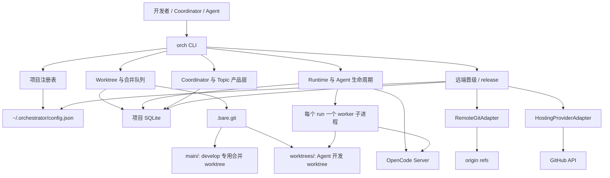
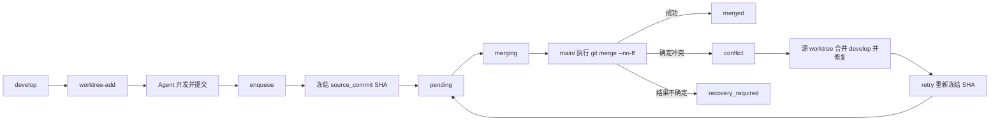
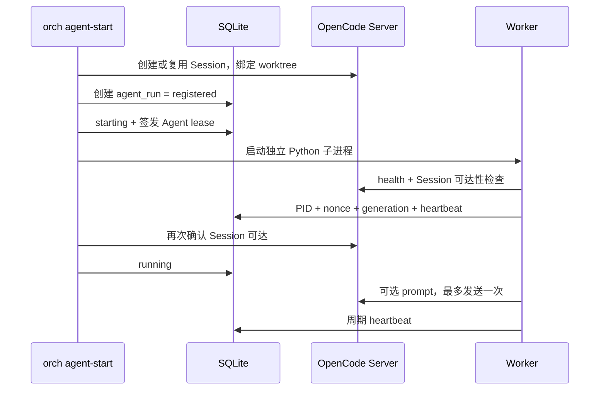

# orch 当前架构与实现现状

> 面向下一阶段开发的接手文档。本文描述当前代码已经实现的架构、核心工作流、关键约束、已知缺口和建议演进方向。
>
> 基线版本：`1.3.0`（D 门签署于 2026-08-04；本文档对齐于 2026-08-24）

## 1. 系统定位

`orch` 是一个运行在单机上的多 Agent Git worktree 编排工具。它不是常驻的中心调度服务，而是由以下组件协作完成控制：

1. `orch` CLI 负责接收命令并编排操作。
2. Git bare repository 保存代码、分支和提交，是代码事实来源。
3. 每项目 SQLite 数据库保存队列、状态机、审计、Agent 运行记录、verification 与 promotion。
4. OpenCode Server 与独立 worker 子进程负责 v1.2 Agent 会话执行。
5. Remote Git adapter 与 Hosting provider（当前 GitHub）负责 v1.3 远端晋级与 release。

系统的核心目标是让多个 Agent 在独立 worktree 中并行开发，只允许通过确定性队列串行修改 **local `develop`**，再经受保护的晋级链发布到 `origin/develop` 与 `origin/master`。

固定晋级链：

```text
feature → local develop → origin/develop → develop→master Promotion PR
        → origin/master → release-sync → release tag
```

## 2. 总体架构



代码按职责分布如下：

| 路径 | 职责 |
|---|---|
| `orch/cli.py` | CLI 解析、命令分派、JSON/JSONL 输出 |
| `orch/commands/` | 应用命令处理器 |
| `orch/git/` | Git 命令执行、ref 与 worktree 校验 |
| `orch/merge/` | claim、merge、finalize、interrupt recovery |
| `orch/runtime/` | OpenCode adapter、Server、worker、lease、takeover |
| `orch/verification/` | commit-bound verification records；topic-ready 桥接 |
| `orch/promotion/` | develop promote、master release、reconcile、freeze 守卫 |
| `orch/remote/` | RemoteGit、GitHub/manual/gitlab provider、probe、auth |
| `orch/state_machine.py` | 合并任务状态机 |
| `orch/agent_state.py` | Agent run 生命周期状态机 |
| `orch/migrations.py` | SQLite schema：v1 → v2 → v3 → v4 |
| `tests/` | 单元、集成和 acceptance 测试 |

## 3. 项目与 Worktree 布局

每个被管理项目采用固定目录结构：

```text
<project-root>/
|-- .bare.git/                 # 中央裸仓库，保存 develop 和 Agent 分支
|-- main/                      # develop 专用 worktree，仅供 orch 合并
`-- worktrees/
    |-- agentA-feat__foo/      # Agent A 开发目录
    `-- agentB-fix__bar/       # Agent B 开发目录
```

`main/` → `integration/` 迁移已评估并**延后**，不阻塞 1.3.0。

宿主级控制数据放在用户目录：

```text
~/.orchestrator/
|-- config.json                # projects + promotion.<project>
|-- config.json.lock
|-- data/<project>/
|   |-- orchestrator.db        # schema user_version=4
|   `-- project.lock
`-- runtime/
    |-- opencode.json
    |-- opencode.credentials.json
    `-- logs/
```

凭证只来自环境变量或 App 安装 token（如 `ORCH_GITHUB_TOKEN`），禁止写入 config / DB / argv / remote URL。

### 3.1 初始化

`orch <project> init` 不创建初始仓库或初始提交。调用前必须已经存在：

- `<project-root>/.bare.git`；
- bare repository 中的 `develop` 分支。

初始化会创建或验证 `main/`：

- 必须属于当前 `.bare.git`；
- 必须检出 `develop`；
- 必须没有未提交修改；
- 不允许作为日常开发 worktree。

### 3.2 创建 Agent Worktree

`worktree-add` 根据 Agent 名与安全化后的分支名生成路径：

```text
worktrees/<agent>-<safe-branch>
```

当前基线分支硬编码为 `develop`。如果目标分支不存在，则从 `develop` 创建；如果已存在，则要求该分支没有被其他 worktree 检出。

## 4. 合并队列实现原理

### 4.1 端到端流程



### 4.2 入队冻结提交

`enqueue` 不只是记录分支名，而是执行以下校验并冻结当时的提交：

- worktree 属于目标 bare repository；
- worktree 当前分支与请求分支一致；
- worktree 干净；
- bare repository 中存在该分支；
- 相比 `develop` 存在至少一个新提交。

校验通过后，分支 HEAD 被保存为 `tasks.source_commit`。之后即使 Agent 继续向该分支提交，也不会改变已经入队任务的内容。

同一分支在 `pending`、`merging`、`conflict` 或 `recovery_required` 状态下只允许存在一个活跃任务。

### 4.3 确定性排序

队列按以下顺序 claim：

```text
priority ASC -> submitted_at ASC -> queue_seq ASC
```

优先级数字越小越先执行；`queue_seq` 是数据库内单调递增计数器，用于消除相同时间戳下的不确定性。

### 4.4 三阶段合并

Git 与 SQLite 无法组成真正的原子事务，因此实现使用三阶段协议：

1. **Precheck + Claim**：短事务把任务从 `pending` 更新为 `merging`，并记录当前 `develop` SHA。
2. **Git Do**：事务外在 `main/` 执行 `git merge --no-ff --no-edit <source_commit>`。
3. **Finalize**：根据 Git 返回值、`HEAD`、`MERGE_HEAD`、工作区状态和祖先关系写回最终状态。

项目明确禁止在 SQLite 写事务中执行 Git，以避免长事务和锁级联。

Active `master_release` 期间，claim 被 `release_freeze` 拒绝（仍可 `enqueue`）。这是 v1.3 双冻结的本地一侧。

### 4.5 冲突与不确定结果

可确认的普通冲突会：

1. 收集冲突文件；
2. 在 `main/` 执行 `git merge --abort`；
3. 将任务标记为 `conflict`。

如果 merge abort 失败、工作区不干净或无法证明 Git 最终状态，则任务进入 `recovery_required`。系统不会猜测操作成功或失败。

任意 `conflict` 或 `recovery_required` 都会阻塞后续队列，直到执行 `retry`、`skip` 或证据化的 `reset-stuck`。

### 4.6 冲突重试

冲突必须在源 worktree 中修复。`retry` 要求：

- worktree 干净；
- worktree 与 bare 分支 HEAD 一致；
- 新 HEAD 不等于旧 `source_commit`；
- 新 HEAD 已包含当前 `develop`。

然后任务回到 `pending`，并将新的 HEAD 冻结为新的 `source_commit`。`retry` 本身只做 Git 读取和数据库更新，不替用户解决冲突。

## 5. 并发控制与持久化

### 5.1 文件锁

系统有三类锁：

| 锁 | 范围 |
|---|---|
| `config.json.lock` | 项目注册表写入、`remote-config` |
| `<project>/project.lock` | 单项目 Git、merge、promotion execute、Agent 控制写 |
| `runtime/opencode.lock` | OpenCode Server start/stop |

锁文件包含 PID、hostname、command、时间和 nonce。强制破锁需要经过存活性和身份校验，不能直接删除锁文件。

### 5.2 SQLite

每个项目使用独立 SQLite，当前 schema 版本为 **4**。连接配置包括：

- foreign keys；
- WAL journal；
- `synchronous=NORMAL`；
- busy timeout；
- 短 `BEGIN IMMEDIATE` 写事务。

主要数据表：

| 表 | 作用 |
|---|---|
| `tasks` | 合并任务、冻结 SHA、冲突与恢复证据 |
| `audit_log` | 锁、入队、claim、合并、恢复、清理审计 |
| `counters` | 合并队列单调序号 |
| `agent_runs` | Agent worker、session 与控制状态 |
| `control_leases` | Agent 或人工单写者 lease |
| `lifecycle_events` | Agent 生命周期事件 |
| `inspection_forks` | 只读检查 Session fork |
| `coordinator_sessions` | 每项目根协调 Session |
| `topics` | 开发主题与 worktree/run 关联 |
| `verification_records` | commit-bound 验证证据（topic / promote / release） |
| `promotion_runs` | develop publish 与 master release 状态机 |
| `promotion_events` | promotion 审计事件（含 release-sync） |
| `promotion_tasks` | promotion 追溯到的本地 merge tasks |

## 6. 四套独立状态机

合并任务、Agent 运行、远端晋级、Topic 生命周期被有意拆开：代码是否已经合入 local develop、Agent 是否仍在运行、远端是否已经发布、专题是否 ready/enqueued/merged，是不同事实。

### 6.1 合并任务状态

```text
pending -> merging -> merged
                   -> conflict -> pending | skipped
                   -> recovery_required -> pending | merged
pending -> skipped
```

`merged` 和 `skipped` 是终态；`conflict` 与 `recovery_required` 是队列阻塞态。

### 6.2 Agent Run 状态

Agent run 同时保存三类状态：

- lifecycle：`registered`、`starting`、`running`、`pausing`、`human_controlled`、`resuming`、`stopping`、`exited`、`lost`、`reconciling`、`manual_required`、`archived`；
- desired：`running`、`paused`、`stopped`；
- observed：`starting`、`running`、`idle`、`busy`、`stopping`、`exited`、`unreachable`。

这种三维状态用于区分用户意图、生命周期阶段和外部观测事实，避免把一次网络不可达直接等同于进程已经退出。

### 6.3 Promotion 状态

`promotion_runs.kind` 为 `develop_publish` 或 `master_release`。当前仓库 mode 冻结为 **`direct_ff`**；`candidate_pr` 全路径 defer。

闭集包括：`created`、`prechecking`、`ready`、`executing`、`awaiting_checks`、`awaiting_approval`、`ready_to_merge`、`published_pending_sync`、`master_merged_pending_sync`、`syncing`、`succeeded`、`released`、`blocked`、`reconciling`、`failed_safe_to_retry`、`manual_required`、`cancelled`。

平台报告 master 已合并后不得直接标 `released`；必须完成 `release-sync` 且 remote develop == `release_merge_sha`。

## 7. Runtime 与 Agent 生命周期

### 7.1 Runtime 边界

`RuntimeAdapter` 隔离 OpenCode HTTP/SSE 协议。当前实现支持：

- health 与 capability probe；
- Session create/get/status；
- async prompt；
- SSE event；
- abort 与 instance dispose；
- Session fork；
- attach command 构造。

Runtime registry 支持两种 Server：

- orch 启动并管理的 managed Server；
- 用户提供的 external Server。

系统不会终止 external Server，也不会 kill 无法验证身份的端口占用者。

### 7.2 Agent 启动



每个 run 都有独立 worker 子进程。worker 不负责合并或资源清理，只负责：

- 校验 worktree 不是 `main/`；
- 连接指定 OpenCode Session；
- 校验控制 lease；
- 最多提交一次初始 prompt；
- 周期写 heartbeat；
- 记录退出证据。

### 7.3 单写者控制

系统通过以下组合阻止旧 worker 或并发控制者继续写：

- `controller_generation`：每次控制权变更递增；
- worker PID 与随机 nonce：确认进程身份；
- control lease：记录 controller、generation、过期时间和 token hash；
- heartbeat：提供运行证据。

数据库只保存 lease token 的 SHA-256 hash，明文 token 只返回给当前控制者。

### 7.4 人工接管

直接接管严格执行：

```text
generation++
-> 等待旧 worker 退出
-> abort OpenCode Session
-> 确认 Session idle
-> 签发 human lease
-> human_controlled
-> 返回可写 attach locator
```

任何步骤无法证实时都不会签发人工 lease，而是进入 `manual_required`。`--fork` 只创建检查副本，不改变原 run 的 controller、generation 或 worker。

## 8. Topic 与 Coordinator 产品层

Topic 位于 worktree、merge queue 和 Agent runtime 之上，用于表达一个持续开发主题。

当前已实现：

- 每项目绑定一个 active coordinator Session；
- 创建、列出、查看、打开和归档 Topic；
- Topic 关联 branch、worktree、coordinator 和可选 active run；
- `topic-ready` 校验 commands 与 commit SHA，桥接为 `verification_records`，并标记 `ready_for_enqueue`。

当前供给闭环（schema 4）：

- `topic-start --agent` 供给隔离 branch + worktree（dest=`worktrees/<agent>-<safe-branch>`），钉住 develop SHA；`--start-session` 才拉 OpenCode。无 session 时保持 `proposed`，不得标 `active`。continue 可补写空的 `agent_name`。
- `topic-ready` 校验 Git 证据（已注册 WT、HEAD 分支、干净工作区、`--commit==HEAD`、`develop..HEAD` 非空），写入 `verification_records`，标记 `ready_for_enqueue`。**不入队、不合入。**
- `topic-enqueue` 把 ready Topic 喂进现有 merge queue；同事务写 `topics.task_id` + `agent_runs.task_id` + `agent_runs.topic_id`。身份是关联图：canonical id 仅为 `topics.id`。
- 入队后应用层冻结：`tasks.status ∈ {pending, merging}` 时禁止第二 task、禁止新 SHA `topic-ready`、禁止在该 WT `agent-start`（`topic_sha_frozen`）。`conflict` / `recovery_required` 允许同 WT 写者与再 `topic-ready`（更新证据，lifecycle 保持 `enqueued`）；仅 `retry` 改 `source_commit`。无第三把 WT 文件锁。`topic-enqueue` 冻结的 SHA 必须等于 `topic-ready` 的 verification SHA。
- merge 成功与 `reset-stuck` recover-as-merged 回写 `lifecycle_state=merged`；`skip` → `rejected` 并清空 `task_id`；`topic-abandon` 将 `proposed|active|ready` 标 `cancelled`（之后 `topic-ready` 拒绝 `topic_ready_illegal`）。
- ready ≠ enqueue ≠ merge ≠ deployed。裸 `enqueue` 遇到活 Topic 同 branch/path 必须拒绝。`master_release` 下仍可 enqueue，claim 被冻。

brief 仍可通过较弱的 `plan_path` 标记保存。

## 9. 远端晋级与 release（v1.3）

默认 dry-run；`--execute` 才写远端。origin/develop 写入必须带 `expected_old_sha` / `new_sha` 的 CAS fast-forward，禁止 `--force`。origin/master 不得由 orch 直接 push，只通过 `head=develop`、`base=master` 的 Promotion PR（merge commit）。

### 9.1 主要命令

| 命令 | 作用 |
|---|---|
| `remote-config` | 写入 promotion 配置（不含 secret、不宣称平台已满足） |
| `remote-probe` | 只读：Git / 身份 / develop policy / master policy / provider |
| `remote-status` | 四 SHA 与 ancestry：`in_sync` / `local_ahead` / `remote_ahead` / `diverged` / `unknown` |
| `promote-develop` | CAS FF 发布 local develop → origin/develop |
| `promotion-list/show/reconcile/cancel` | 观察、超时只读对账、合法取消 |
| `release-create/status` | 创建 develop→master PR；不自动批准或合并 |
| `release-sync` | 平台合并后把 merge commit 同步回 develop，完成后才 `released` |

### 9.2 硬门槛与冻结

- 无 `passed` 且未过期的 `verification_records` 时，promote / release fail-closed。
- Active release 同时冻结新的 `promote-develop --execute` 与 local merge claim。
- `sync_verified_merge` 仅经领域授权路径调用，不能替代 feature merge queue。
- GitLab provider 仅为占位；manual provider 明确 `unsupported`。

## 10. 清理策略

`cleanup --prune` 只考虑已经 `merged` 且超过 24 小时 cooldown 的任务。实际删除前还必须通过：

- 无活跃、lost、manual_required 或 human-controlled run；
- 无未过期 lease；
- 可选 blocking `BeforeWorktreeRemove` hook 通过；
- worktree 属于目标 bare repository；
- worktree 干净且唯一注册；
- 分支没有在其他 worktree 检出；
- 分支 tip 已经是 `develop` 的祖先。

通过后按顺序执行：

1. 删除 worktree；
2. 使用带旧 tip 校验的 `update-ref -d` 删除分支；
3. 执行 `git worktree prune`；
4. 设置任务 `archived_at` 并写审计。

Runtime guard 始终先于 Git 删除操作，hook 也不能绕过内建 guard。

## 11. 安全边界

`orch` 是协调与防误操作工具，不是 OS 安全沙箱。

它可以保证经过 orch 的操作遵守队列、锁、状态机和清理规则，但同一用户下有文件写权限的进程仍可绕过 orch：

- 直接执行 `git update-ref`；
- 修改 SQLite；
- 删除锁文件；
- 读取同用户可读的 credentials。

因此不能把 orch 当成跨账号隔离或恶意代码防护边界。

## 12. 当前成熟度

### 12.1 已形成闭环

- 项目注册与初始化；
- Agent worktree 创建；
- 提交 SHA 冻结与确定性合并队列；
- 冲突、重试、skip 和 evidence-based recovery；
- 审计、文件锁和 SQLite 状态机；
- runtime registry、worker、lease、takeover 与 cleanup guard；
- `verification_records` 与 topic-ready 桥接；
- `direct_ff` 下 promote-develop → release-create → 平台合并 → release-sync。

其中 v1.1 worktree/merge queue 仍是最成熟的内核。v1.3 远端晋级已签署 `1.3.0`。

### 12.2 版本与历史门禁

| 版本 | 代码 | 独立 D 门 |
|---|---|---|
| v1.1 merge queue | 已落地 | 未单独签署（被后续版本覆盖） |
| v1.2 runtime / topic | 已落地 | 未签署：crash drills 与 Desktop H3/H4/H9 仍缺 |
| v1.3 promotion / release | 已落地 | **已签署**（2026-08-04） |

当前对外版本字符串是 `1.3.0`。v1.2 的未签项不再挡住 1.3，但仍是运行时质量债。

### 12.3 已知实现缺口

1. Topic 供给闭环已落地（CLI argv：`topic-start --agent` → ready → enqueue → merge/skip/abandon）；`--start-session` 才需要 runtime。
2. 入队后 `topics.task_id` / `agent_runs.task_id` / `agent_runs.topic_id` 同事务写入；无 run 时后两列保持空，lookup 以 `topics.task_id` 为准。
3. Runtime capability 假设没有作为 server generation 的强约束持续校验。
4. 安装主要依赖脚本与 wrapper，尚无标准 `pyproject.toml` 打包。
5. 项目名唯一，但同一路径可以被不同名称重复注册。
6. `candidate_pr` 全路径 defer（mode=`direct_ff`）。
7. GitLab provider 未实现。
8. Solo `OrganizationAdmin` bypass 仍为临时债，团队化后必须移除。

## 13. 下一阶段建议

### 已落地：Topic 供给闭环（V14 + V15）

产品路径（无 runtime 也可走完）：`topic-start --agent` 供给隔离（`--start-session` 才拉 OpenCode）→ `topic-ready`（Git 证据，不入队）→ `topic-enqueue`（verification SHA 必须等于 branch tip）→ `merge` / `retry` / `skip` / `reset-stuck` 回写 Topic。`merged` 只表示到达本地 `develop`。

后续加固见 [`docs/topic-closed-loop-v15-tasks.md`](topic-closed-loop-v15-tasks.md) 未完成项（路径大小写变体、CLI `--help` 锁表、id-or-name）。

保持 `topic-ready` 与 enqueue 的显式边界：ready 永不入队。

### P1：收紧领域关联

明确 Topic、Agent run 和 merge task 的所有权及唯一性：

- 一个 Topic 同时最多一个 active run；
- enqueue 后 Topic 必须可定位唯一 task；
- archive/cleanup 必须能从任一实体追溯完整链路；
- 对关键关联增加数据库约束和迁移。

### P1：版本化 Runtime Capability

将 probe 结果绑定到：

- OpenCode 版本；
- server ID；
- server generation；
- probe 时间和结果摘要。

Server 重启、升级或重新登记后，关键能力必须重新确认。

### P2：工程化完善

- 添加标准 `pyproject.toml` 与 console script；
- 增加结构化运行日志和诊断导出；
- 整理模块依赖，避免 `cli.py` 和生命周期服务继续膨胀；
- 为迁移、runtime adapter 和故障恢复建立更明确的兼容性策略。

### 有意延期 / 不在下一刀

- `candidate_pr` 全路径；
- `main/` → `integration/` 改名；
- GitLab 完整 provider；
- 自动 break-glass；
- 将 `freeze_local_merge_queue_during_release` 改为 `false`。

可选加固（不挡 1.3.0）：补跑 v1.2 crash drills 与 Desktop H3/H4/H9。

## 14. 开发时必须保持的架构不变量

1. local `develop` 只能通过 orch 的 merge queue 或受锁的 `release-sync` / candidate-sync 修改，不得手改 `main/`。
2. `main/` 只用于合并，不用于日常开发或 Agent worker。
3. 入队任务必须冻结明确的 `source_commit`。
4. Git 命令不得运行在 SQLite 写事务内部。
5. 不确定的外部结果必须进入 recovery/manual 状态，不能猜测成功。
6. 控制权变更必须递增 generation，使旧 writer 失效。
7. 未确认 Session idle 前不得签发人工可写 lease。
8. cleanup 必须先通过 runtime guard，再进行任何 Git 删除。
9. external 或身份不明的 Server/进程不得由 orch 终止。
10. `topic-ready` 永不入队或合入；enqueue / merge / deployed 是后续独立步骤。入队后 SHA 冻结，仅 retry 可改 source_commit。
11. origin/develop 只允许带旧/新 SHA 的非强制 CAS；禁止 `--force` / `--force-with-lease`。
12. origin/master 不得由 orch 直接 push；只经 Promotion PR 的 merge commit。
13. 无 `passed` 且未过期的 verification 时，promote / release 必须 fail-closed。
14. 平台 merged 后必须 `release-sync` 才能标 `released` 并解冻。
15. secret 不得进入 argv、SQLite、audit、JSON、异常或 remote URL。

## 15. 进一步阅读

- `README.md`：安装、命令和快速使用。
- `docs/usage-scenarios.md`：worktree 合并队列和人工接管场景。
- `docs/topic-industry-analysis.md`：Topic 类系统行业对照。
- `docs/topic-closed-loop-plan.md`：Topic 执行闭环开发方案（§0 为规格权威）。
- `docs/topic-closed-loop-v15-tasks.md`：相对 §0 的整改任务。
- `docs/remote-branch-promotion-design.md`：远端晋级设计。
- `docs/v1.3-tasks.md` / `docs/v1.3-tasks-009-012.md`：v1.3 任务与完成记录。
- `docs/v1.3-acceptance-results.md`：v1.3 验收矩阵。
- `docs/v1.3-ready-checklist.md`：v1.3 发布门禁（已签）。
- `docs/omo-goal-quickstart.md`：oh-my-openagent `/goal` + orch worktree。
- `docs/v1.2-upgrade-plan.md`：v1.2 原始设计（历史）。
- `docs/tasks.md`：v1.2 任务跟踪（历史）。
- `docs/v1.2-acceptance-results.md` / `docs/v1.2-ready-checklist.md`：v1.2 历史门禁。
- `docs/acceptance-results.md` / `docs/ready-checklist.md`：v1.1 历史门禁。
- `task.md`：v1.1 实施任务清单（历史）。
