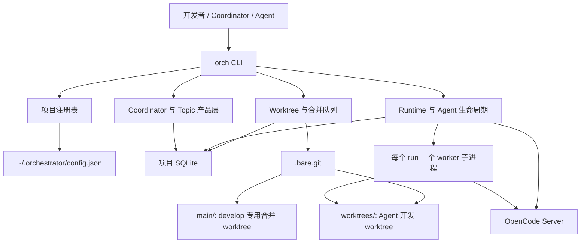
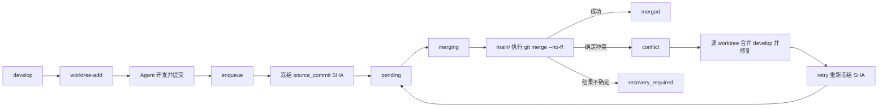
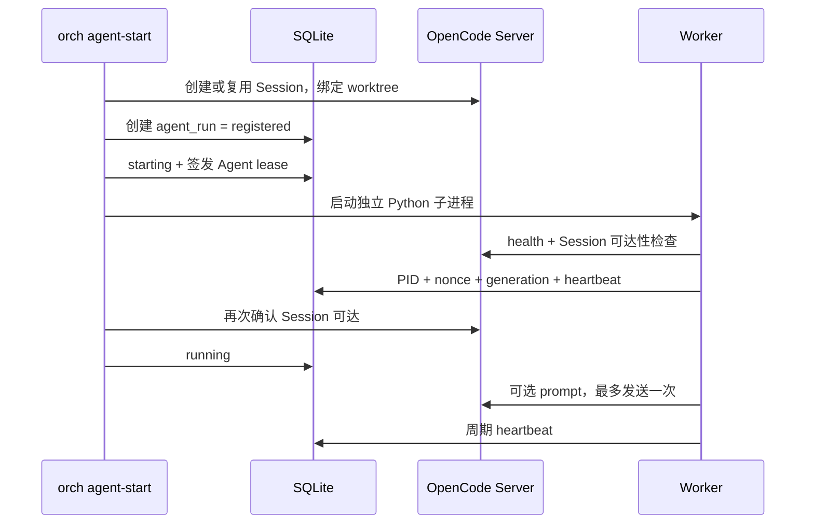

# orch 当前架构与实现现状

> 面向下一阶段开发的接手文档。本文描述当前代码已经实现的架构、核心工作流、关键约束、已知缺口和建议演进方向。
>
> 基线版本：`1.2.0-candidate`（代码状态截至 2026-08-01）

## 1. 系统定位

`orch` 是一个运行在单机上的多 Agent Git worktree 编排工具。它不是常驻的中心调度服务，而是由以下组件协作完成控制：

1. `orch` CLI 负责接收命令并编排操作。
2. Git bare repository 保存代码、分支和提交，是代码事实来源。
3. 每项目 SQLite 数据库保存队列、状态机、审计和 Agent 运行记录。
4. OpenCode Server 与独立 worker 子进程负责 v1.2 Agent 会话执行。

系统的核心目标是让多个 Agent 在独立 worktree 中并行开发，同时只允许通过确定性队列串行修改 `develop`。

## 2. 总体架构



代码按职责分布如下：

| 路径 | 职责 |
|---|---|
| `orch/cli.py` | CLI 解析、命令分派、JSON/JSONL 输出 |
| `orch/commands/` | 应用命令处理器 |
| `orch/git/` | Git 命令执行、ref 与 worktree 校验 |
| `orch/merge/` | claim、merge、finalize、interrupt recovery |
| `orch/runtime/` | OpenCode adapter、Server、worker、lease、takeover |
| `orch/state_machine.py` | 合并任务状态机 |
| `orch/agent_state.py` | Agent run 生命周期状态机 |
| `orch/migrations.py` | SQLite schema 和 v1 到 v2 迁移 |
| `tests/` | 单元、集成和 acceptance 测试 |

## 3. 项目与 Worktree 布局

每个被管理项目采用固定目录结构：

```text
<project-root>/
|-- .bare.git/                 # 中央裸仓库，保存 develop 和 Agent 分支
|-- main/                      # develop 专用 worktree，仅供 orch 合并
`-- worktrees/
    |-- agentA-feat__foo/      # Agent A 开发目录
    `-- agentB-fix__bar/       # Agent B 开发目录
```

宿主级控制数据放在用户目录：

```text
~/.orchestrator/
|-- config.json
|-- config.json.lock
|-- data/<project>/
|   |-- orchestrator.db
|   `-- project.lock
`-- runtime/
    |-- opencode.json
    |-- opencode.credentials.json
    `-- logs/
```

### 3.1 初始化

`orch <project> init` 不创建初始仓库或初始提交。调用前必须已经存在：

- `<project-root>/.bare.git`；
- bare repository 中的 `develop` 分支。

初始化会创建或验证 `main/`：

- 必须属于当前 `.bare.git`；
- 必须检出 `develop`；
- 必须没有未提交修改；
- 不允许作为日常开发 worktree。

### 3.2 创建 Agent Worktree

`worktree-add` 根据 Agent 名与安全化后的分支名生成路径：

```text
worktrees/<agent>-<safe-branch>
```

当前基线分支硬编码为 `develop`。如果目标分支不存在，则从 `develop` 创建；如果已存在，则要求该分支没有被其他 worktree 检出。

## 4. 合并队列实现原理

### 4.1 端到端流程



### 4.2 入队冻结提交

`enqueue` 不只是记录分支名，而是执行以下校验并冻结当时的提交：

- worktree 属于目标 bare repository；
- worktree 当前分支与请求分支一致；
- worktree 干净；
- bare repository 中存在该分支；
- 相比 `develop` 存在至少一个新提交。

校验通过后，分支 HEAD 被保存为 `tasks.source_commit`。之后即使 Agent 继续向该分支提交，也不会改变已经入队任务的内容。

同一分支在 `pending`、`merging`、`conflict` 或 `recovery_required` 状态下只允许存在一个活跃任务。

### 4.3 确定性排序

队列按以下顺序 claim：

```text
priority ASC -> submitted_at ASC -> queue_seq ASC
```

优先级数字越小越先执行；`queue_seq` 是数据库内单调递增计数器，用于消除相同时间戳下的不确定性。

### 4.4 三阶段合并

Git 与 SQLite 无法组成真正的原子事务，因此实现使用三阶段协议：

1. **Precheck + Claim**：短事务把任务从 `pending` 更新为 `merging`，并记录当前 `develop` SHA。
2. **Git Do**：事务外在 `main/` 执行 `git merge --no-ff --no-edit <source_commit>`。
3. **Finalize**：根据 Git 返回值、`HEAD`、`MERGE_HEAD`、工作区状态和祖先关系写回最终状态。

项目明确禁止在 SQLite 写事务中执行 Git，以避免长事务和锁级联。

### 4.5 冲突与不确定结果

可确认的普通冲突会：

1. 收集冲突文件；
2. 在 `main/` 执行 `git merge --abort`；
3. 将任务标记为 `conflict`。

如果 merge abort 失败、工作区不干净或无法证明 Git 最终状态，则任务进入 `recovery_required`。系统不会猜测操作成功或失败。

任意 `conflict` 或 `recovery_required` 都会阻塞后续队列，直到执行 `retry`、`skip` 或证据化的 `reset-stuck`。

### 4.6 冲突重试

冲突必须在源 worktree 中修复。`retry` 要求：

- worktree 干净；
- worktree 与 bare 分支 HEAD 一致；
- 新 HEAD 不等于旧 `source_commit`；
- 新 HEAD 已包含当前 `develop`。

然后任务回到 `pending`，并将新的 HEAD 冻结为新的 `source_commit`。`retry` 本身只做 Git 读取和数据库更新，不替用户解决冲突。

## 5. 并发控制与持久化

### 5.1 文件锁

系统有三类锁：

| 锁 | 范围 |
|---|---|
| `config.json.lock` | 项目注册表写入 |
| `<project>/project.lock` | 单项目 Git 与控制状态写操作 |
| `runtime/opencode.lock` | OpenCode Server start/stop |

锁文件包含 PID、hostname、command、时间和 nonce。强制破锁需要经过存活性和身份校验，不能直接删除锁文件。

### 5.2 SQLite

每个项目使用独立 SQLite，当前 schema 版本为 2。连接配置包括：

- foreign keys；
- WAL journal；
- `synchronous=NORMAL`；
- busy timeout；
- 短 `BEGIN IMMEDIATE` 写事务。

主要数据表：

| 表 | 作用 |
|---|---|
| `tasks` | 合并任务、冻结 SHA、冲突与恢复证据 |
| `audit_log` | 锁、入队、claim、合并、恢复、清理审计 |
| `counters` | 合并队列单调序号 |
| `agent_runs` | Agent worker、session 与控制状态 |
| `control_leases` | Agent 或人工单写者 lease |
| `lifecycle_events` | Agent 生命周期事件 |
| `inspection_forks` | 只读检查 Session fork |
| `coordinator_sessions` | 每项目根协调 Session |
| `topics` | 开发主题与 worktree/run 关联 |

## 6. 两套独立状态机

合并任务和 Agent 运行状态被有意拆开，因为“代码是否已经合并”和“Agent 是否仍在运行”是两个不同事实。

### 6.1 合并任务状态

```text
pending -> merging -> merged
                   -> conflict -> pending | skipped
                   -> recovery_required -> pending | merged
pending -> skipped
```

`merged` 和 `skipped` 是终态；`conflict` 与 `recovery_required` 是队列阻塞态。

### 6.2 Agent Run 状态

Agent run 同时保存三类状态：

- lifecycle：`registered`、`starting`、`running`、`pausing`、`human_controlled`、`resuming`、`stopping`、`exited`、`lost`、`reconciling`、`manual_required`、`archived`；
- desired：`running`、`paused`、`stopped`；
- observed：`starting`、`running`、`idle`、`busy`、`stopping`、`exited`、`unreachable`。

这种三维状态用于区分用户意图、生命周期阶段和外部观测事实，避免把一次网络不可达直接等同于进程已经退出。

## 7. Runtime 与 Agent 生命周期

### 7.1 Runtime 边界

`RuntimeAdapter` 隔离 OpenCode HTTP/SSE 协议。当前实现支持：

- health 与 capability probe；
- Session create/get/status；
- async prompt；
- SSE event；
- abort 与 instance dispose；
- Session fork；
- attach command 构造。

Runtime registry 支持两种 Server：

- orch 启动并管理的 managed Server；
- 用户提供的 external Server。

系统不会终止 external Server，也不会 kill 无法验证身份的端口占用者。

### 7.2 Agent 启动



每个 run 都有独立 worker 子进程。worker 不负责合并或资源清理，只负责：

- 校验 worktree 不是 `main/`；
- 连接指定 OpenCode Session；
- 校验控制 lease；
- 最多提交一次初始 prompt；
- 周期写 heartbeat；
- 记录退出证据。

### 7.3 单写者控制

系统通过以下组合阻止旧 worker 或并发控制者继续写：

- `controller_generation`：每次控制权变更递增；
- worker PID 与随机 nonce：确认进程身份；
- control lease：记录 controller、generation、过期时间和 token hash；
- heartbeat：提供运行证据。

数据库只保存 lease token 的 SHA-256 hash，明文 token 只返回给当前控制者。

### 7.4 人工接管

直接接管严格执行：

```text
generation++
-> 等待旧 worker 退出
-> abort OpenCode Session
-> 确认 Session idle
-> 签发 human lease
-> human_controlled
-> 返回可写 attach locator
```

任何步骤无法证实时都不会签发人工 lease，而是进入 `manual_required`。`--fork` 只创建检查副本，不改变原 run 的 controller、generation 或 worker。

## 8. Topic 与 Coordinator 产品层

Topic 位于 worktree、merge queue 和 Agent runtime 之上，用于表达一个持续开发主题。

当前已实现：

- 每项目绑定一个 active coordinator Session；
- 创建、列出、查看、打开和归档 Topic；
- Topic 关联 branch、worktree、coordinator 和可选 active run；
- `topic-ready` 校验调用方提供了 commands 和 commit SHA，并标记 `ready_for_enqueue`。

当前没有形成完整闭环：

- `topic-start` 不自动创建 branch/worktree/session/worker；
- `topic-ready` 不自动 enqueue；
- 没有独立 `topic-enqueue` 命令；
- verification 结果未作为独立记录完整持久化；
- brief 仍通过较弱的 `plan_path` 标记保存。

因此，当前 Topic 更接近“产品记录与导航层”，还不是端到端编排器。

## 9. 清理策略

`cleanup --prune` 只考虑已经 `merged` 且超过 24 小时 cooldown 的任务。实际删除前还必须通过：

- 无活跃、lost、manual_required 或 human-controlled run；
- 无未过期 lease；
- 可选 blocking `BeforeWorktreeRemove` hook 通过；
- worktree 属于目标 bare repository；
- worktree 干净且唯一注册；
- 分支没有在其他 worktree 检出；
- 分支 tip 已经是 `develop` 的祖先。

通过后按顺序执行：

1. 删除 worktree；
2. 使用带旧 tip 校验的 `update-ref -d` 删除分支；
3. 执行 `git worktree prune`；
4. 设置任务 `archived_at` 并写审计。

Runtime guard 始终先于 Git 删除操作，hook 也不能绕过内建 guard。

## 10. 安全边界

`orch` 是协调与防误操作工具，不是 OS 安全沙箱。

它可以保证经过 orch 的操作遵守队列、锁、状态机和清理规则，但同一用户下有文件写权限的进程仍可绕过 orch：

- 直接执行 `git update-ref`；
- 修改 SQLite；
- 删除锁文件；
- 读取同用户可读的 credentials。

因此不能把 orch 当成跨账号隔离或恶意代码防护边界。

## 11. 当前成熟度

### 11.1 已形成闭环

- 项目注册与初始化；
- Agent worktree 创建；
- 提交 SHA 冻结与确定性合并队列；
- 冲突、重试、skip 和 evidence-based recovery；
- 审计、文件锁和 SQLite 状态机；
- runtime registry、worker、lease、takeover 与 cleanup guard。

其中 v1.1 worktree/merge queue 是当前最成熟、最适合继续作为稳定内核的部分。

### 11.2 候选态能力

当前版本仍为 `1.2.0-candidate`。正式发布前尚需完成：

- 全量真实 OS 强杀演练；
- Desktop takeover/release H3/H4/H9 复验签署；
- 操作者发布确认和版本同步 bump。

### 11.3 已知实现缺口

1. Topic 到 worktree、worker、verification、enqueue 的端到端编排尚未闭环。
2. Topic verification 缺少独立、可查询、关联 commit 的持久化模型。
3. `task_id`、`agent_run_id`、`topic_id` 之间仍是较松散的可空关联。
4. Runtime capability 假设没有作为 server generation 的强约束持续校验。
5. 安装主要依赖脚本与 wrapper，尚无标准 `pyproject.toml` 打包。
6. 项目名唯一，但同一路径可以被不同名称重复注册。

## 12. 下一阶段建议

建议按以下顺序演进：

### P0：补齐 Topic 执行闭环

将 Topic 建模为可恢复的应用流程，而不是不可观察的一键脚本：

```text
topic-start
-> worktree-add
-> agent-start
-> development
-> topic-ready
-> topic-enqueue
-> merge
-> archive/cleanup
```

每一步都应保存状态、输入、输出和失败证据，并支持幂等重试。

### P0：持久化验证证据

新增 `verification_records`，至少记录：

- topic 和 commit SHA；
- 命令及工作目录；
- 开始与结束时间；
- exit code；
- stdout/stderr 摘要或证据文件路径；
- 操作者；
- 结果状态。

`topic-ready` 应根据持久化证据判定，而不是只信任一次调用参数。

远端分支晋级方案同样把 `verification_records` 视为 Phase 2/3 的硬前置：
develop promotion 需要绑定最终聚合 `source_sha` 的验证记录，candidate PR
还要记录实际 `published_sha` 的 post-verification；在这张表和查询契约
落地前，远端 promotion 只能停留在能力探测/只读状态，不能进入自动 push
或 master release。

### P0：完成候选版发布门禁

完成 crash drills 与 Desktop 接管复验。在这些真实环境假设被签署前，不应移除 `-candidate`。

### P1：收紧领域关联

明确 Topic、Agent run 和 merge task 的所有权及唯一性：

- 一个 Topic 同时最多一个 active run；
- enqueue 后 Topic 必须可定位唯一 task；
- archive/cleanup 必须能从任一实体追溯完整链路；
- 对关键关联增加数据库约束和迁移。

### P1：版本化 Runtime Capability

将 probe 结果绑定到：

- OpenCode 版本；
- server ID；
- server generation；
- probe 时间和结果摘要。

Server 重启、升级或重新登记后，关键能力必须重新确认。

### P2：工程化完善

- 添加标准 `pyproject.toml` 与 console script；
- 增加结构化运行日志和诊断导出；
- 整理模块依赖，避免 `cli.py` 和生命周期服务继续膨胀；
- 为迁移、runtime adapter 和故障恢复建立更明确的兼容性策略。

## 13. 开发时必须保持的架构不变量

1. `develop` 只能通过 orch 的 merge queue 修改。
2. `main/` 只用于合并，不用于日常开发或 Agent worker。
3. 入队任务必须冻结明确的 `source_commit`。
4. Git 命令不得运行在 SQLite 写事务内部。
5. 不确定的外部结果必须进入 recovery/manual 状态，不能猜测成功。
6. 控制权变更必须递增 generation，使旧 writer 失效。
7. 未确认 Session idle 前不得签发人工可写 lease。
8. cleanup 必须先通过 runtime guard，再进行任何 Git 删除。
9. external 或身份不明的 Server/进程不得由 orch 终止。
10. `topic-ready` 与 enqueue/merge 保持显式边界，直到新的应用流程具备完整幂等和恢复语义。

## 14. 进一步阅读

- `README.md`：安装、命令和快速使用。
- `docs/usage-scenarios.md`：两个端到端场景，直观展示 worktree 合并队列和人工接管流程。
- `docs/remote-branch-promotion-design.md`：本地 develop、线上 develop 与稳定 master 的受保护晋级设计。
- `docs/v1.2-upgrade-plan.md`：v1.2 原始设计与架构决策。
- `docs/tasks.md`：阶段任务与实现记录。
- `docs/v1.2-acceptance-results.md`：自动化和真实环境验收状态。
- `docs/v1.2-crash-drills.md`：故障演练清单。
- `docs/v1.2-ready-checklist.md`：正式发布门禁。
