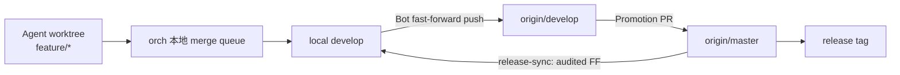
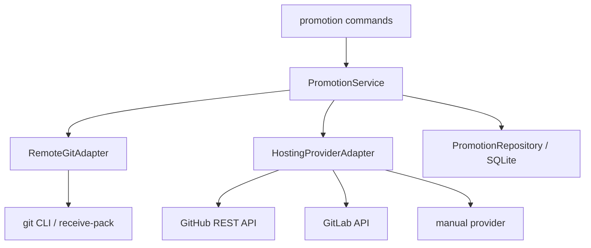
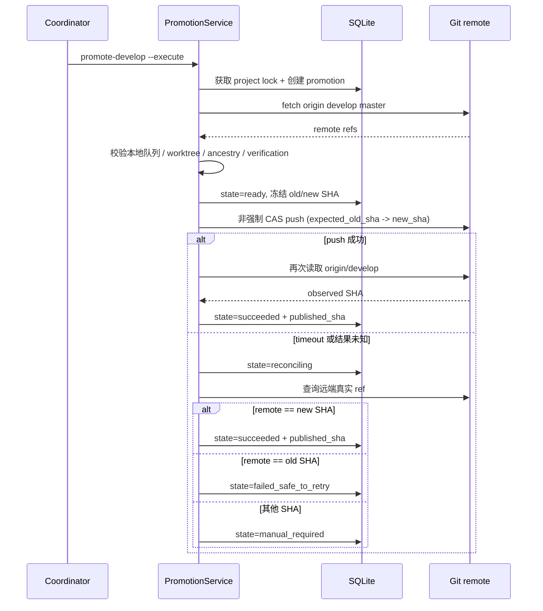
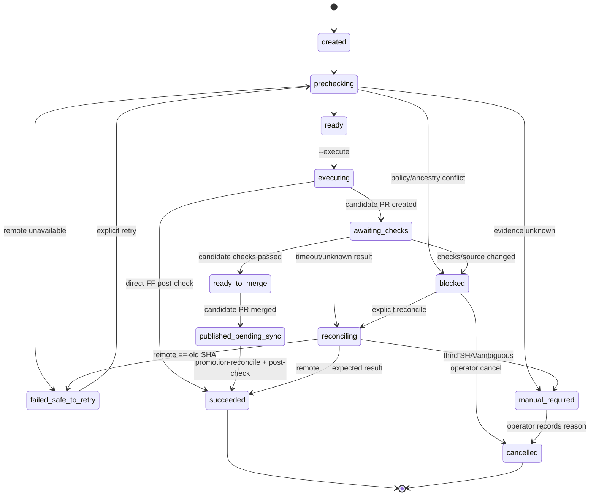
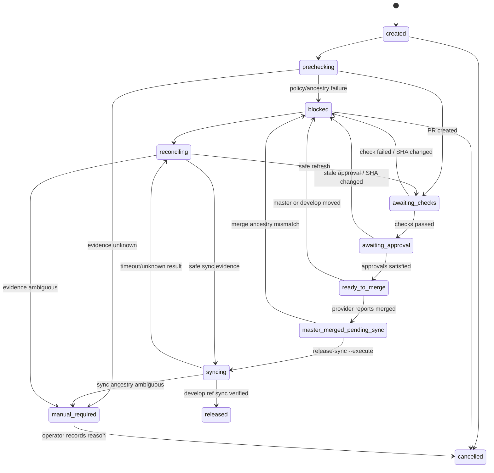
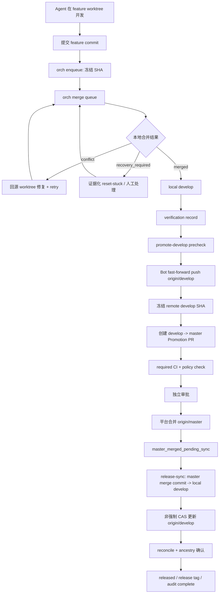

# 远端核心分支晋级与保护设计

> 状态：In implementation（以 `docs/v1.3-tasks.md` 阶段退出与完成记录为准）
>
> 目标版本：orch v1.3（建议）
>
> 基线：`1.2.0-candidate`
>
> 决策日期：2026-08-01

> 本轮专家审查修订（2026-08-01）：补齐正常发布后的 `release-sync`，把
> `verification_records` 明确为 Phase 2/3 的硬前置，修正 candidate PR 的
> 合成 SHA 追溯口径，统一 reconcile 命名，并把远端写入的旧/新 SHA 绑定
> 明确为 adapter 的 CAS 契约。`--force` 与 `--force-with-lease` 仍禁止，
> 因为目标分支规则要求拒绝所有 force 语义；adapter 必须把预期旧 SHA
> 传入固定 refspec 写入并按服务端返回判定竞态。

## 1. 摘要

本设计在现有 worktree 与本地 merge queue 之上增加“远端晋级层”，首选 GitHub 作为远端平台，建立唯一、可审计的代码流向：

```text
feature/*
  -> 本地 develop
  -> origin/develop
  -> develop 到 master 的 Promotion PR
  -> origin/master
  -> release-sync（master merge commit 回纳 develop）
  -> release tag
```

职责分为两道独立闸门：

1. **本地集成闸门**：现有 orch merge queue 决定哪些冻结提交可以进入本地 `develop`。
2. **远端发布闸门**：Git 托管平台的 protected branch、CI 和审批决定 `origin/develop` 何时可以晋级到 `origin/master`。

核心原则是：本地流程由 orch 控制，远端最终权限由 Git 服务端控制。插件、客户端约定或本地文件锁都不能替代远端分支保护。

### 1.1 专家审查处置摘要

| 审查意见 | 处置 | 设计结果 |
|---|---|---|
| merge commit 使第二次 release 失效 | 采纳 | master merge 后强制 `release-sync`，同步完成前不标记 `released` |
| `verification_records` 悬空 | 采纳 | 增加最小 schema 与 Phase 1.5，作为 Phase 2/3 硬门槛 |
| candidate PR 合成 SHA 无验证/追溯 | 采纳 | 区分 `source_sha`/`published_sha`，增加 post-verification 和系统事件 |
| old SHA 绑定与 push 机制不一致 | 部分采纳 | adapter 必须显式接收旧/新 SHA 并使用服务端 CAS；因 Ruleset 禁止 force，仍不使用 `--force-with-lease` |
| CLI reconcile/cancel 命名不一致 | 采纳 | 统一为 `promotion-reconcile`/`promotion-cancel`，新增受限 `release-sync` |
| develop_publish 状态机不完整 | 采纳 | 补齐 retry、reconcile、manual/cancel 和 candidate sync 转换 |
| up-to-date + freeze 有可用性风险 | 采纳风险说明 | 保留稳定优先默认；master 移动即 blocked/cancel/reconcile，不自动 Update branch |
| verification 粒度不匹配 promotion | 采纳 | 每次聚合 promotion 必须在最终 source SHA 上重新验证 |
| 默认分支可能是 main | 采纳 | probe 显式验证 develop/master refs，不从 default branch 推断 |

额外推演发现：只冻结 remote develop、却允许 local merge queue 在 release
期间继续前进，会破坏 `release-sync` 的 fast-forward 前提，并可能把未验证
代码顺带发布。因此 v1.3 默认同时冻结 local develop merge queue；feature
worktree 仍可继续开发和入队。

## 2. 背景与现状

当前 orch 已实现：

- Agent 独立 worktree；
- 入队时冻结 `source_commit`；
- feature commit 按确定性队列串行合入本地 `develop`；
- 冲突、恢复、锁和审计；
- Agent runtime、lease 和人工接管。

当前 orch 尚未实现：

- remote 配置与能力探测；
- `fetch`、远端 ref 对账和 push；
- `origin/develop` 晋级记录；
- `develop -> master` Promotion PR；
- 远端 CI、审批和分支保护状态读取；
- 远端异常修改后的 reconcile。
- 独立、可查询且按 commit SHA 绑定的 `verification_records`（当前只有
  Topic 上的自由格式 verification dict）。

### 2.1 命名澄清

当前常量：

```text
TARGET_BRANCH = develop
MAIN_WORKTREE_NAME = main
```

其中 `main/` 是本地目录名，该 worktree 实际检出 `develop`。它不是远端稳定分支，也不表示 `origin/master`。

本文统一使用以下术语：

| 术语 | 含义 |
|---|---|
| integration worktree | 当前名为 `main/`、实际检出 `develop` 的本地合并目录 |
| local develop | bare repository 中的 `refs/heads/develop` |
| remote develop | `refs/remotes/origin/develop` 对应的线上开发主分支 |
| remote master | 线上稳定版本主分支 `origin/master` |
| develop promotion | local develop 快进发布到 remote develop |
| master release | 通过 Promotion PR 将 remote develop 合入 remote master |

## 3. 目标与非目标

### 3.1 目标

1. Agent 和普通开发者不能直接写入 `origin/develop` 或 `origin/master`。
2. 本地 feature 工作只能先通过 orch merge queue 进入 local develop。
3. 在 direct-FF 模式下，local develop 只能以 fast-forward 方式发布到
   origin/develop；candidate PR 降级模式下，origin/develop 先由受保护
   candidate PR 产生合成 merge commit，再由受审计的系统同步操作把该
   commit fast-forward 纳入 local develop。
4. origin/master 只能通过来源为同仓库 `develop` 的 Promotion PR 更新。
5. 任何远端写操作必须绑定明确的旧 SHA、新 SHA、身份、验证证据和时间。
6. 远端状态发生竞态或无法证明时必须失败关闭，进入 blocked/manual 状态。
7. 不破坏现有 v1.1 worktree、merge queue 和冲突恢复语义。
8. GitHub 作为首个完整 provider；GitLab 或自建 Git 服务通过后续 adapter 扩展。

### 3.2 非目标

1. 不在本阶段实现通用 GitFlow 或任意目标分支。
2. 不允许 feature branch 直接向 origin/master 发起正常发布 PR。
3. 不让 orch 绕过远端 protected branch 或管理员审批。
4. 不把 orch 提升为跨 OS 账号安全沙箱。
5. 不自动解决远端分叉、历史重写或未知 master hotfix。
6. 不在 v1.3 第一阶段自动配置云端仓库权限；先探测和验证，再选择是否自动化。

## 4. 架构决策

### D1：固定单向晋级链



不支持以下正常路径：

```text
feature/* -> origin/develop
feature/* -> origin/master
local develop -> origin/master
任意本地分支 -> origin/master
```

### D2：本地合并与远端晋级分离

现有 `tasks` 状态机继续只负责 feature commit 到 local develop：

```text
pending -> merging -> merged/conflict/recovery_required
```

远端晋级使用独立 `promotion_runs` 状态机。不能把“本地已经 merged”等同于
“已经发布到 origin/develop”，也不能把“已经发布 develop”等同于“已经发布
master”。正常 feature 变更仍只由 merge queue 产生；master/candidate
merge commit 纳入 local develop 只能走受锁、可审计的系统 ref 同步：
master release 使用 `release-sync`，candidate PR 使用
`promotion-reconcile` 的 candidate-sync 路径。

### D3：origin/develop 只允许受控 fast-forward

正常 direct promotion 使用固定 refspec 的非强制 push。`RemoteGitAdapter`
必须接收并记录 `expected_old_sha` 与 `new_sha`，在写入前确认远端 ref 仍为
预期旧 SHA，并让 Git receive-pack 用协议中的旧/新 OID 做服务端 CAS；
旧 SHA 不匹配时必须报告竞态，而不是重试覆盖。

禁止：

- `--force`；
- `--force-with-lease`（目标 Ruleset 将所有 force 语义视为违规）；
- 删除 `develop`；
- 推送不包含当前 remote develop 的提交。

因此，显式旧 SHA 绑定是 adapter 的输入契约和服务端 ref 更新结果，不能
由当前 checkout、`push.default` 或一个未核对的本地快照隐式推断。若某个
provider 无法提供非 force 的旧/新 SHA CAS，`remote-probe` 必须标记
`unsupported`，流程只能使用 candidate PR 降级模式。

### D4：origin/master 只通过 Promotion PR

orch 不直接 push `origin/master`。正常发布通过同仓库的：

```text
head = develop
base = master
```

Promotion PR 必须绑定创建时的 `develop` SHA，并要求：

- required CI checks 全部通过；
- 最新提交之后仍有有效审批；
- 来源仓库与目标仓库相同；
- 来源分支严格等于 `develop`；
- 目标分支严格等于 `master`；
- master 是 develop 的祖先；
- 合并方式必须是保留 develop source SHA 父提交的 merge commit；
- 不存在未解决对话或平台定义的 merge blocker。

### D5：发布窗口期间冻结 remote develop 与 local merge queue

Promotion PR 创建后，如果 origin/develop 继续移动，PR 内容会变化，旧 CI 和审批可能失效。为了保证“审批内容就是最终合入内容”，默认策略为：

```text
master release 处于 awaiting_checks / awaiting_approval / ready_to_merge /
master_merged_pending_sync / syncing
=> promote-develop 拒绝新的远端 develop 发布
```

feature worktree 中的 Agent 可以继续开发，但 v1.3 默认冻结 local develop
merge queue（可继续创建/入队，不能把新 task 合入 local develop），同时冻结
local develop 到 origin/develop 的远端 promotion。这样 `release-sync` 可以
证明 local develop 仍是 release `source_sha`，不会把未经 aggregate
verification 的新代码顺带发布。master 发布只有在 `release-sync` 完成后才
算结束；在此之前不能合入或发布新的 develop 内容。

这是默认的稳定优先策略。未来如果要允许 merge queue 在 release 窗口继续前进，
必须另行设计 `source_sha` 暂存分支、release merge commit 回纳、未验证提交
隔离和新的 aggregate verification gate；不能只把配置改为 `false`。

### D6：GitHub 是首选 provider，平台能力仍通过 adapter 隔离



Git ref 操作和 GitHub PR/审批操作属于不同协议，必须使用不同 adapter。v1.3 先实现 GitHub adapter，但领域服务只能依赖 `HostingProviderAdapter`，不能直接依赖 GitHub 响应格式。

## 5. 角色与最小权限

建议使用三个身份，避免一个 token 同时拥有全部能力：

| 身份 | 权限 | 明确禁止 |
|---|---|---|
| Agent / Developer | push feature branch（如需要）、读取 PR/CI | push develop/master、批准自己的发布 |
| Integration Bot | fetch；仅 fast-forward push develop | push master、force push、批准 PR |
| Release Bot | 创建/查询 develop->master PR、读取 checks | 直接 push master、批准 PR |
| Release Approver | 审批 Promotion PR | 直接 push核心分支 |

GitHub 推荐使用两个 GitHub App installation token：

- `orch-integration-app`：只允许对 `develop` 写入；
- `orch-release-app`：创建/查询 PR 和读取 checks，不允许直接写 `master`。

如果组织暂时无法细分两个 App，可临时合并为一个 GitHub App，但仍不得给它 `master` direct push 或 approval 权限。

凭证规则：

- Git push 优先使用系统 Git credential helper 或 Git App 短期 token；
- provider API token 通过环境或权限受限的 credentials 文件传递；
- token 不进入 CLI argv、SQLite、audit、JSON 输出或异常文本；
- 管理员 bypass 默认关闭；
- 生产发布审批不能由创建 PR 的 Bot 自我完成。

## 6. 远端分支保护策略

### 6.1 origin/develop（GitHub Ruleset）

必须配置：

- 禁止 force push；
- 禁止删除；
- 普通用户与 Agent 无直接 push 权限；
- 只允许 Integration Bot 更新；
- Bot 不具备 master 写权限；
- 可选要求 commit signature；
- 对分支保护配置变更保留平台审计。

GitHub 上建议创建针对 `develop` 的 branch ruleset：

- target branch pattern：`develop`；
- restrict deletions：启用；
- block force pushes：启用；
- restrict updates：只允许 `orch-integration-app`；
- bypass actors：仅 Integration App，禁止个人管理员默认 bypass；
- 可选 required signed commits。

> **Solo 临时例外（非默认）：** 当仓库仅有一名人类且其为 Promotion PR 作者又是唯一 Code Owner 时，GitHub 禁止自审会导致 master Ruleset 永久 BLOCKED。允许在 master Ruleset 临时加入 `OrganizationAdmin` bypass（`always`），仅用于破局合并；团队化后必须移除。develop Ruleset **仍禁止**个人 bypass。操作说明见 `docs/github-app-ruleset-setup.md` §8。

注意：允许 Bot 直接 push 代表服务端信任该 GitHub App。流程正确性由 orch
promotion precheck、带显式 expected-old/new SHA 的非强制 CAS fast-forward
和 App 权限隔离共同保证。若组织要求 GitHub 服务端本身验证每次 develop
更新都来自审批流程，应改为“候选分支 -> develop PR”模型，不能只依赖规则
描述。

Phase 0 必须实际验证 Ruleset 对 GitHub App 的 restrict-update/bypass 行为。如果无法证明 Integration App 只能更新 `develop` 且不能更新 `master`，则禁止启用 Bot 直推，降级为：

```text
local develop
  -> origin/orch-candidate/<promotion-id>
  -> candidate 到 develop 的受保护 PR
  -> origin/develop
  -> develop 到 master 的 Promotion PR
```

该降级增加一道 PR，但把分支来源和审批完全交给 GitHub 服务端，是权限能力不足时的安全默认值。

candidate PR 模式必须使用 GitHub merge commit，禁止 squash 或 rebase。合并
后，orch 在 project lock 下 fetch 新的 `origin/develop`，验证该合成
`published_sha` 包含冻结的 local develop `source_sha`，并要求 provider
checks/验证证据绑定到实际合成 SHA；随后通过 `promotion-reconcile` 的
candidate-sync 系统操作把
local develop fast-forward 到该远端 merge commit。这个 GitHub 生成的晋级
merge commit 是“local develop 的正常 feature 变更只能来自 merge queue”
之外唯一受审计的 ref 同步例外，不能伪装成普通 feature task；如果团队不
接受该例外，Phase 0 应直接阻塞而不是启用 candidate PR 模式。

candidate promotion 的 `source_sha` 表示待发布的本地 develop 内容，
`published_sha` 表示 candidate PR 合并后实际写入 origin/develop 的 SHA。
前者必须有本地 aggregate verification，后者必须有 post-publish
verification 或 provider checks 的确定证据；`promotion_tasks` 只追溯
source SHA 包含的本地 merge tasks，不把合成 merge commit 错记为 task 产物。
从 candidate PR 创建到 `published_sha` 同步完成期间，同样冻结 local
develop merge queue，保证 local develop 仍为 source SHA；否则合成 commit
无法以 fast-forward 方式纳入本地分支。

### 6.2 origin/master（GitHub Ruleset）

针对 `master` 创建 GitHub branch ruleset，必须配置：

- 禁止直接 push、force push 和删除；
- 必须通过 PR；
- required checks；
- 至少一名非 Bot 审批者；
- dismiss stale approvals；
- required conversation resolution；
- 禁止管理员默认 bypass；
- required status check `promotion-policy` 校验 `head=develop`、`base=master`、同仓库来源；
- **必须使用 merge commit**，并保留 develop `source_sha` 作为父提交；
  squash/rebase 会制造无法按本设计自动同步回 develop 的新历史，Phase 0
  不得将其作为正常模式启用。

建议的 GitHub Ruleset 选项：

| GitHub 选项 | 设计值 | 原因 |
|---|---|---|
| Require a pull request | 开启 | 禁止直接更新 master |
| Required approvals | 至少 1 | 发布审批与 Bot 分离 |
| Dismiss stale approvals | 开启 | develop SHA 改变后必须重新审批 |
| Require status checks | 开启 | CI 与来源策略必须通过 |
| Require conversation resolution | 开启 | 未解决评审意见不得发布 |
| Require branches up to date | 开启（稳定优先默认） | 发布前重新基于最新 master 验证；发布窗口内禁止 master 并发写入，移动后进入 blocked/cancel/reconcile，不自动把 master 合入冻结 develop |
| Block force pushes | 开启 | 禁止重写稳定历史 |
| Restrict deletions | 开启 | 禁止删除 master |
| Linear history | 关闭 | 保留 develop -> master 的 merge commit |
| Bypass list | 最小化 | 不允许默认管理员绕过 |

发布窗口内不使用 GitHub 的 Update branch 自动修改 `develop`。默认开启
`Require branches up to date` 是稳定性优先的可用性折衷：发布窗口必须尽量
无竞态；如果 `master` 在 release 期间移动，当前 release 进入 `blocked`，
由 reconcile 判断是已授权发布还是未授权写入，必要时取消并重新创建 release。
不能自动把新 master 合入冻结的 develop。若团队选择更高发布可用性，可在
真实演练后关闭该选项，但必须依靠冻结 head SHA、source/base 校验和合并后
ancestry 复核，并把这一选择记录为 provider policy 变体，而不是隐式改变
默认安全模型。

### 6.3 GitHub required `promotion-policy` check

GitHub Ruleset 可以保护目标分支，但不能仅靠普通规则保证 PR 来源一定是 `develop`。因此需要一个作为 required check 的 GitHub Actions workflow：

```text
base_ref == master
head_ref == develop
head_repository == base_repository
```

任何条件不满足，check 必须失败，PR 不可合并。

示意 workflow：

```yaml
name: promotion-policy

on:
  pull_request:
    types: [opened, synchronize, reopened]

permissions:
  contents: read
  pull-requests: read

jobs:
  source-policy:
    runs-on: ubuntu-latest
    steps:
      - name: Require develop to master in the same repository
        env:
          BASE_REF: ${{ github.event.pull_request.base.ref }}
          HEAD_REF: ${{ github.event.pull_request.head.ref }}
          BASE_REPO: ${{ github.event.pull_request.base.repo.full_name }}
          HEAD_REPO: ${{ github.event.pull_request.head.repo.full_name }}
        run: |
          test "$BASE_REF" = "master"
          test "$HEAD_REF" = "develop"
          test "$BASE_REPO" = "$HEAD_REPO"
```

该 workflow 只读取 GitHub event 元数据，不 checkout 或执行 PR 分支代码，也不使用额外 secret。它只是来源策略检查，不替代 orch 的 SHA 对账，也不替代 GitHub Ruleset。

## 7. 配置模型

为保持现有 `projects: {name: path}` 兼容，建议在 `~/.orchestrator/config.json` 增加独立顶层配置，不改变项目注册表形状。GitHub 配置示例：

```json
{
  "projects": {
    "shop": "D:\\projects\\shop-orch"
  },
  "promotion": {
    "shop": {
      "remote": "origin",
      "provider": "github",
      "repository": "company/shop",
      "api_base_url": "https://api.github.com",
      "integration_branch": "develop",
      "stable_branch": "master",
      "release_merge_method": "merge_commit",
      "freeze_develop_during_release": true,
      "freeze_local_merge_queue_during_release": true,
      "required_checks": [
        "test",
        "build",
        "promotion-policy"
      ],
      "required_approvals": 1
    }
  }
}
```

约束：

- `integration_branch` 初始版本必须是 `develop`；
- `stable_branch` 初始版本必须是 `master`；
- `release_merge_method` 初始版本必须是 `merge_commit`；
- `freeze_local_merge_queue_during_release` 初始版本必须为 `true`；
- remote name 需要通过 `git remote get-url` 验证；
- repository identity 必须与 remote URL 解析结果一致；
- `remote-probe` 必须验证 `refs/heads/develop` 与 `refs/heads/master` 真实
  存在；仓库 default branch（例如 `main`）仅作为平台元数据，不能替代
  `stable_branch`；
- secret 不允许写入此配置。

## 8. CLI 设计

建议新增以下项目命令：

```text
orch <project> remote-config
orch <project> remote-probe
orch <project> remote-status
orch <project> promote-develop
orch <project> promotion-list
orch <project> promotion-show <promotion_id>
orch <project> promotion-reconcile <promotion_id>
orch <project> promotion-cancel <promotion_id>
orch <project> release-create
orch <project> release-status <promotion_id>
orch <project> release-sync <promotion_id>
```

### 8.1 remote-config

用途：写入非 secret 的 remote/provider 配置。

```powershell
orch shop remote-config `
  --remote origin `
  --provider github `
  --repository company/shop `
  --integration develop `
  --stable master `
  --json
```

写入前只做格式验证，不宣称平台能力已经满足。

### 8.2 remote-probe

用途：验证实际 Git 和托管平台能力，不修改分支。

检查项：

| 类别 | 检查 |
|---|---|
| Git | remote 可达、develop/master 存在、默认 fetch 行为 |
| 身份 | 当前 Bot 身份、可见仓库与权限范围 |
| develop policy | 禁止 force/delete、仅 Integration Bot 可写 |
| master policy | PR-only、审批、checks、stale approval、no bypass |
| provider | 创建/查询 PR、读取 checks/reviews、读取 branch protection |

输出必须区分：

- `verified`：已通过真实远端读取验证；
- `unsupported`：平台明确不支持；
- `unknown`：权限不足或 API 无法证明；
- `misconfigured`：实际策略不满足设计。

`unknown` 不得被当作通过。

### 8.3 remote-status

只读展示四个关键 SHA：

```text
local_develop_sha
remote_develop_sha
remote_master_sha
last_successful_promotion_sha
```

并给出关系：

- `in_sync`：local develop == remote develop；
- `local_ahead`：remote develop 是 local develop 祖先；
- `remote_ahead`：local develop 是 remote develop 祖先；
- `diverged`：互不为祖先；
- `unknown`：无法获取或证明。

### 8.4 promote-develop

默认先 dry-run 输出计划，显式 `--execute` 才写远端：

```powershell
orch shop promote-develop --json
orch shop promote-develop --execute --verification <record-id> --json
```

禁止使用模糊的 `--force`。失败后通过 reconcile 恢复，而不是重复盲推。

### 8.5 release-create

```powershell
orch shop release-create `
  --verification <record-id> `
  --title "Release 2026.08.01" `
  --json
```

创建 `develop -> master` PR，并把 provider PR ID、URL、source SHA、target SHA 写入 promotion record。该命令不自动批准或合并 PR。

GitHub PR body 应包含机器可读但不含 secret 的 promotion metadata：

```text
orch-promotion-id: promo_...
source-ref: develop
source-sha: <sha>
target-ref: master
target-sha-before: <sha>
verification-record: verify_...
```

metadata 便于人工审查和 `promotion-reconcile` 定位，但不能替代 GitHub API 返回的真实 ref 和 SHA。

### 8.6 release-status

读取远端真实状态并展示：

- PR 是否仍为 `develop -> master`；
- current head SHA 是否等于冻结 source SHA；
- CI checks；
- approvals；
- mergeability；
- master 当前 SHA；
- 是否已经合并、关闭或被外部修改。

### 8.7 release-sync

`release-sync` 只允许处理已经被 provider 报告合并、但尚未完成 develop
同步的 master release。它在 project lock 下执行以下固定步骤：

1. fetch `origin/master` 和 `origin/develop`，验证 provider 返回的
   `release_merge_sha` 是当前 master 真实 tip，并且包含 release 的
   `source_sha`；
2. 验证 local develop 仍等于 release `source_sha`，或已经等于
   `release_merge_sha`；
3. 以 `--ff-only` 将 local develop 从 `source_sha` 推进到
   `release_merge_sha`，写入 `release_sync` 系统事件；
4. 使用 `expected_old_sha -> release_merge_sha` 的非强制 CAS refspec
   更新 origin/develop；
5. 重新读取两个远端 ref，只有 remote develop 等于
   `release_merge_sha` 才允许 release 进入 `released`。

默认只读预览，显式 `--execute` 才写入。该命令不能接受任意 source/target
ref，也不能替代 feature merge queue。`promotion-reconcile` 可以在证据明确
时调用同一幂等操作；`promotion-cancel` 负责释放无法继续的人工阻塞记录。

### 8.8 promotion-cancel

`promotion-cancel <promotion_id> --reason <text>` 只允许取消尚未成功写入
目标分支的 promotion，或已进入 `manual_required` 且操作者已经记录调查
结论的 promotion。取消必须写入 actor、原因和最后观测到的 SHA；不能用
cancel 隐藏已经发生的远端写入，也不能取消后立即重用同一 source SHA 而
跳过新的 precheck。

## 9. develop promotion 详细流程



### 9.1 Precheck

`promote-develop` 必须在 project lock 下完成以下检查：

1. bare repository、integration worktree 和 local develop 有效；
2. integration worktree 干净，无 `MERGE_HEAD`；
3. 没有 `merging`、`conflict` 或 `recovery_required` 任务；
4. 没有活跃 master release 冻结 remote develop；
5. remote/provider 配置已通过有效期内的 probe；
6. fetch 后 remote develop/master SHA 可确定；
7. remote develop 是 local develop 的祖先；
8. local develop 不等于 remote develop；
9. 存在针对本次 promotion `source_sha` 的 aggregate verification record；
10. verification 未过期且 required commands 全部成功；
11. direct-FF 模式下 provider 能提供非强制旧/新 SHA CAS；若只能使用
    candidate PR，则改走候选 PR 状态机，不得假装是 fast-forward push；
12. Bot 身份和远端策略仍满足要求。

允许存在尚未 claim 的 `pending` 任务，因为它们尚未进入 local develop。
promotion 只发布当前冻结的 local develop `source_sha`，并在记录中列出从
old SHA 到 source SHA 包含的已合并任务。若窗口内积累了多个 merge task，
必须在最终 source SHA 上重新执行一次 aggregate verification；逐 topic 的
verification 只能作为 provenance，不能替代聚合提交的发布门禁。

### 9.2 Push 与确认

写操作必须使用明确 refspec，并把 precheck 读取的旧 SHA 作为 adapter 的
显式参数：

```text
expected_old_sha -> new_sha
refs/heads/develop:refs/heads/develop
```

不得依赖当前 checkout branch 或 `push.default`。服务端发现当前 ref 不等于
`expected_old_sha` 时必须返回竞态失败；客户端不得通过 force 语义绕过。
push 成功后仍需重新读取远端 ref；direct-FF 只有观察到 remote develop 等于
`source_sha` 才能标记成功，candidate PR 则把实际合成 SHA 写入
`published_sha`，并完成 post-publish verification 后再标记成功。

### 9.3 幂等性

相同项目、相同 kind、相同 `source_sha` 只能有一个非取消 promotion；
`published_sha` 是最终写入目标 ref 的实际 SHA，direct-FF 时等于
`source_sha`，candidate PR 时等于 provider 生成的 merge commit。

- remote 已等于 `new_sha`：返回已有成功记录；
- remote 仍等于 `old_sha`：允许从安全失败状态重试；
- remote 为第三个 SHA：进入 `manual_required`；
- 客户端超时：先 reconcile，不能立即再次 push。

### 9.4 develop_publish 状态机

`develop_publish` 的合法转换必须明确，避免 `manual_required` 或
`failed_safe_to_retry` 永久占用 active promotion 槽位：



`manual_required` 是保守停留态，不允许自动重试；只有
`promotion-cancel` 记录人工原因后才释放唯一性约束。candidate 模式只能由
`promotion-reconcile` 的受控 candidate-sync 从
`published_pending_sync` 进入 `succeeded`，不能由普通 feature task 代替。

## 10. master release 详细流程



### 10.1 创建前条件

1. origin/develop 和 origin/master 可确定；
2. origin/master 是 origin/develop 的祖先；
3. 没有其他 active master release；
4. develop promotion 已成功并与当前 remote develop SHA 一致；
5. aggregate verification record 绑定当前 remote develop `source_sha`，且
   未过期、required commands 全部成功；
6. master ruleset 与 required policy check 已验证；
7. PR source/base 必须是同仓库 `develop/master`；
8. provider 支持并实际配置为 merge commit，不能使用 squash/rebase；
9. 当前仓库存在 `develop`、`master` 两个配置分支；default branch 名称
   不能替代 `stable_branch` 配置。

### 10.2 冻结发布内容

创建 release 时记录：

```text
source_sha = origin/develop SHA
target_sha_before = origin/master SHA
```

在 release 完成或取消前，默认阻止新的 `promote-develop`，并冻结 local
develop merge queue；feature worktree 仍可继续开发和提交。每次
status/reconcile 都重新验证：

- PR head SHA == source_sha；
- PR base SHA/当前 master 与记录兼容；
- checks 和 approvals 针对 provider 返回的当前 PR head/merge SHA，并能
  明确映射到冻结 `source_sha`；不能只看 PR 页面上的 green；
- PR 没有被改成其他 source/base。

release 期间冻结 remote develop 的同时也冻结 release 的 source SHA。若
需要新增代码，必须取消当前 release，先走完整 develop promotion，再创建
新的 release；不能在同一 PR 上移动 head 或使用 GitHub Update branch 把
master 合入 develop。

### 10.3 合并责任

v1.3 初始版本建议由平台 UI 或受控 Release Bot 完成最终 merge，orch 只负责创建、观察和审计。原因是：

- 平台是 protected branch 的最终裁决者；
- 人工审批必须保持独立；
- 减少 orch 持有 master 写权限；
- 首期避免错误模拟不同平台的 merge queue 行为。

平台报告 PR 已合并后，状态先进入 `master_merged_pending_sync`，不能直接
标记 `released`。orch 必须：

1. 验证 `origin/master` 的真实 tip 等于 provider 返回的
   `release_merge_sha`，且该 merge commit 包含冻结 `source_sha`；
2. 验证 provider 使用 merge commit，不能把 squash/rebase 结果当作可同步
   的 release；
3. 在 project lock 下执行 `release-sync`：local develop 从 `source_sha`
   以 `--ff-only` 推进到 `release_merge_sha`，并记录 `release_sync` 系统
   事件；
4. 以明确 `expected_old_sha -> release_merge_sha` 的非强制 CAS 更新
   origin/develop；
5. 重新读取 remote master/develop，确认 master 是 develop 的祖先且
   remote develop 等于 `release_merge_sha`。

只有第 5 步完成后状态才变为 `released`，并解除 develop promotion 冻结。
如果同步结果未知，进入 `reconciling`；不能重复盲推或直接放行下一次发布。

## 11. 数据模型

建议 schema 3 增加：`verification_records`（§11.4，Phase 1.5）以及三张
promotion 表（§11.1–§11.3）。同一 `PRAGMA user_version=3` 容纳上述对象。

### 11.1 promotion_runs

```sql
CREATE TABLE promotion_runs (
  id TEXT PRIMARY KEY,
  project_name TEXT NOT NULL,
  kind TEXT NOT NULL CHECK(kind IN ('develop_publish','master_release')),
  mode TEXT NOT NULL CHECK(mode IN ('direct_ff','candidate_pr','promotion_pr')),
  state TEXT NOT NULL CHECK(state IN (
    'created','prechecking','ready','executing',
    'awaiting_checks','awaiting_approval','ready_to_merge',
    'published_pending_sync','master_merged_pending_sync','syncing',
    'succeeded','released','blocked','reconciling',
    'failed_safe_to_retry','manual_required','cancelled'
  )),
  remote_name TEXT NOT NULL,
  provider TEXT NOT NULL,
  source_ref TEXT NOT NULL,
  target_ref TEXT NOT NULL,
  source_sha TEXT NOT NULL,
  target_sha_before TEXT NOT NULL,
  published_sha TEXT,
  observed_target_sha TEXT,
  verification_record_id TEXT,
  post_verification_record_id TEXT,
  external_id TEXT,
  external_url TEXT,
  created_by TEXT NOT NULL,
  created_at TEXT NOT NULL,
  updated_at TEXT NOT NULL,
  finished_at TEXT,
  last_error TEXT
);
```

`mode` 与 SHA 的语义固定如下：

| mode | kind | `source_sha` | `published_sha` |
|---|---|---|---|
| `direct_ff` | `develop_publish` | local develop 待发布内容 | 与 source 相同 |
| `candidate_pr` | `develop_publish` | candidate PR head / local develop 内容 | GitHub 合成 develop merge commit |
| `promotion_pr` | `master_release` | 本次 master PR 的 source SHA | master release merge commit，同时成为 develop sync 目标 |

唯一性约束：

```sql
CREATE UNIQUE INDEX idx_promotion_active_kind
ON promotion_runs(project_name, kind)
WHERE state NOT IN ('succeeded','released','cancelled');

CREATE UNIQUE INDEX idx_promotion_source
ON promotion_runs(project_name, kind, source_sha)
WHERE state NOT IN ('cancelled');
```

### 11.2 promotion_events

```sql
CREATE TABLE promotion_events (
  id INTEGER PRIMARY KEY AUTOINCREMENT,
  promotion_id TEXT NOT NULL,
  seq INTEGER NOT NULL,
  event_type TEXT NOT NULL,
  source TEXT NOT NULL,
  detail TEXT,
  created_at TEXT NOT NULL,
  UNIQUE(promotion_id, seq),
  FOREIGN KEY(promotion_id) REFERENCES promotion_runs(id)
);
```

事件 detail 只记录脱敏后的 SHA、ref、provider 状态和错误类型，不记录 token、authorization header 或完整敏感响应。

### 11.3 promotion_tasks

```sql
CREATE TABLE promotion_tasks (
  promotion_id TEXT NOT NULL,
  task_id TEXT NOT NULL,
  merged_commit TEXT NOT NULL,
  PRIMARY KEY(promotion_id, task_id),
  FOREIGN KEY(promotion_id) REFERENCES promotion_runs(id),
  FOREIGN KEY(task_id) REFERENCES tasks(id)
);
```

该表使一次 develop promotion 可以追溯包含了哪些本地 merge task。

`release-sync` 不伪造 `task_id`：它通过 `promotion_events` 记录
`source_sha`、`release_merge_sha`、old/new remote ref 和执行身份；若需要把
同步纳入审计链，使用事件类型 `release_sync_started`、
`release_sync_published`、`release_sync_reconciled`，而不是把平台 merge
commit 填入某个 feature task。

`verification_records` 是本设计的硬前置，但命令执行器仍属于独立 verification
模块。promotion 只消费并引用其结果，不接受临时 JSON 作为发布门禁：

### 11.4 verification_records（Phase 1.5 硬前置）

当前代码只有 Topic 上的自由格式 verification dict，没有独立表；在进入
Phase 2 develop promotion 或 Phase 3 master release 前，必须先落地以下最小
持久化契约：

```sql
CREATE TABLE verification_records (
  id TEXT PRIMARY KEY,
  project_name TEXT NOT NULL,
  scope TEXT NOT NULL CHECK(scope IN (
    'topic','develop_publish','candidate_publish','master_release'
  )),
  commit_sha TEXT NOT NULL,
  status TEXT NOT NULL CHECK(status IN (
    'running','passed','failed','expired','superseded'
  )),
  commands_json TEXT NOT NULL,
  results_json TEXT NOT NULL,
  created_by TEXT NOT NULL,
  started_at TEXT NOT NULL,
  finished_at TEXT,
  expires_at TEXT,
  topic_id TEXT,
  created_at TEXT NOT NULL
);
```

`results_json` 只能保存脱敏摘要或证据文件路径，不能保存 token、完整
authorization header 或未经裁剪的敏感日志。`develop_publish` 的
verification 必须绑定最终 local develop `source_sha`；批量包含多个 topic
时需要在聚合提交上重新运行 required commands。`candidate_publish` 还必须
绑定实际 `published_sha`，不能把 source SHA 的 topic 记录冒充合成 merge
commit 的验证。master release 可以复用同一 source SHA 的通过记录，但
checks/approval 仍需独立绑定 provider 返回的实际 PR SHA。

## 12. 模块设计

建议新增：

```text
orch/
|-- promotion/
|   |-- service.py          # 领域编排与状态转换
|   |-- state.py            # promotion 状态机
|   |-- repo.py             # SQLite 持久化
|   |-- precheck.py         # 本地/远端不变量检查
|   |-- reconcile.py        # 证据化恢复
|   `-- policy.py           # 分支、身份、verification 策略
|-- remote/
|   |-- git.py              # fetch/ls-remote/push adapter
|   |-- adapter.py          # HostingProviderAdapter Protocol
|   |-- github.py           # GitHub 实现（能力验证后）
|   |-- gitlab.py           # GitLab 实现（能力验证后）
|   `-- manual.py           # 无 API 时仅输出操作/读取 Git 证据
`-- commands/
    |-- remote.py
    `-- promotion.py
```

### 12.1 RemoteGitAdapter

```python
class RemoteGitAdapter(Protocol):
    def fetch_core_refs(self, bare, remote, develop, master): ...
    def remote_head(self, bare, remote, branch): ...
    def is_ancestor(self, bare, older, newer): ...
    def push_fast_forward(
        self,
        bare,
        remote,
        source_ref,
        target_ref,
        expected_old_sha,
        new_sha,
    ): ...
    def sync_verified_merge(self, bare, source_sha, published_sha): ...
```

`push_fast_forward` 必须拒绝 source/new SHA 不一致、旧 SHA 不匹配或非祖先
更新；`sync_verified_merge` 只允许在 `source_sha -> published_sha`
可证明为 fast-forward 时执行，master release 与 candidate PR 由领域层分别
授权。所有 Git 调用继续使用 argv 数组、
`shell=False` 和超时。错误输出进入统一脱敏路径。

### 12.2 HostingProviderAdapter

```python
class HostingProviderAdapter(Protocol):
    def probe_capabilities(self): ...
    def branch_policy(self, branch): ...
    def create_promotion_pr(self, head, base, title, body): ...
    def get_pr(self, external_id): ...
    def get_checks(self, external_id, source_sha): ...
    def get_reviews(self, external_id, source_sha): ...
```

领域服务只能依赖 Protocol，不能直接散落 GitHub/GitLab HTTP 请求。

### 12.3 GitHubProviderAdapter

GitHub 首选实现通过 REST API 完成：

| 能力 | GitHub 资源 | 关键返回事实 |
|---|---|---|
| 当前身份 | authenticated app/user | App installation 与 actor identity |
| Ruleset 探测 | repository rulesets/rules | target、enforcement、bypass actors、required checks |
| PR 创建/查询 | pulls | number、head/base ref、head/base SHA、state、merged |
| Checks | commits/check-runs 或 combined status | check name、conclusion、关联 SHA |
| Reviews | pulls/reviews | actor、state、submitted commit |
| Merge 结果 | pull + Git refs | merge commit、master SHA、source ancestry |

adapter 必须保存解析后的稳定领域字段，不得把原始 GitHub JSON 直接泄漏给 `PromotionService`。GitHub 返回 `mergeable=null` 时代表尚未计算完成，应按有界退避重新读取，不能解释为不可合并或已经通过。

### 12.4 GitHub App 最小权限

实施前应通过真实安装权限界面和正反请求验证下表，权限名称以 GitHub 实际返回为准：

| App | Repository permission 意图 | 用途 |
|---|---|---|
| Integration App | Contents: write；Metadata: read | 只用于 Git 读取与 develop push |
| Release App | Pull requests: write；Checks/Commit statuses: read；Contents: read；Metadata: read | 创建/查询 PR 与读取门禁 |

两个 App 都不应拥有 Administration 写权限、master bypass 或 review approval 能力。Ruleset 读取如果需要额外管理权限，应优先在独立 `remote-probe` 凭证中解决，不扩大日常 promotion token。

GitHub App installation token 应短期获取、只保存在内存或 Git credential helper 中。若需要用 token 完成 HTTPS push，应通过 credential helper 或 askpass 传递，不能拼接进 remote URL、argv 或日志。

## 13. 失败模型与恢复

| 失败 | 检测 | 状态 | 恢复 |
|---|---|---|---|
| remote 不可达 | fetch/ls-remote 超时 | `failed_safe_to_retry` | 网络恢复后重新 precheck |
| push 被 non-fast-forward 拒绝 | Git 返回码和远端 ref | `blocked` | fetch 后判断 ahead/diverged |
| push 超时但可能已成功 | 结果未知 | `reconciling` | 读取 remote ref，不盲目重推 |
| remote develop 为第三个 SHA | ref 对账 | `manual_required` | 人工调查未授权写入 |
| provider API 超时 | HTTP 超时 | `reconciling` | 按 source/base 查找现有 PR |
| PR 已存在 | provider 查询 | 复用记录 | 校验 head/base/SHA 后绑定 |
| PR head SHA 改变 | status 对账 | `blocked` | 取消或重新创建 release |
| CI 失败 | required checks | `blocked` | 修复必须回到 develop 流程 |
| approval 失效 | review 针对旧 SHA | `awaiting_approval` | 最新 SHA 重新审批 |
| master 被外部更新 | remote ref 改变 | `blocked/manual_required` | 判断是否仍为 develop 祖先 |
| 平台报告 merged 但 Git 不包含 source | Git ancestry 不成立 | `manual_required` | 禁止标记 released |
| master 已合并但 develop 尚未同步 | release merge 后的 ref 对账 | `master_merged_pending_sync` | 运行 `release-sync`，失败则 reconcile |
| candidate PR 产生合成 SHA | origin/develop ref 对账 | `published_pending_sync` | 绑定 published SHA，完成同步和 post-verification |
| release-sync 超时但可能已成功 | local/remote ref 结果未知 | `reconciling` | 先读 local/remote ref，不重复盲推 |

恢复原则：

1. 先读取 Git 和 provider 外部事实，再修改 SQLite；
2. 无法证明时保守停留在 `manual_required`；
3. 不通过 reset/force push 修复控制面不一致；
4. reconcile 必须幂等，并把每次证据写入 promotion events。

## 14. Hotfix 与回滚

### 14.1 正常 Hotfix

严格模式下 hotfix 仍走唯一晋级链：

```text
hotfix/* worktree
  -> local develop
  -> origin/develop
  -> Promotion PR
  -> origin/master
```

不允许 hotfix 直接进入 master。

### 14.2 Break-glass

如果业务必须支持紧急绕行，应单独设计，不纳入普通 `release-create`：

普通 merge-commit release 的 `release-sync` 不属于 break-glass，它是每次
正常发布的必经步骤；break-glass 仅处理 master 出现不属于当前 develop
source 的额外提交或其他不可证明的历史变化。

- 需要两人审批或显式管理员身份；
- 记录事件编号、原因和过期时间；
- 禁止 force push；
- 变更后立即冻结常规 promotion；
- 必须把 master 新提交通过受控 reconcile 合回 local develop；
- 完成复盘前不得恢复正常发布。

初始版本建议不实现自动 break-glass，仅记录人工操作规程。

### 14.3 回滚

禁止 reset 或重写 master。生产回滚通过新的 revert commit 走相同链路：

```text
revert worktree -> local develop -> origin/develop -> master PR
```

若必须立即回滚，应走 break-glass 并随后同步 develop。

## 15. 可观测性与审计

每次 promotion 至少输出和记录：

- promotion ID 和 kind；
- local develop、remote develop、remote master SHA；
- old/new/published/observed SHA；
- 包含的 task IDs；
- verification record ID；
- candidate 或 release-sync 的系统事件及 post-verification record；
- Bot 身份（非凭证）；
- provider PR ID/URL；
- checks 与 approvals 摘要；
- 每次状态转换及证据来源；
- 最终 release merge commit 和 tag。

建议 JSON envelope 保持现有 schema 风格。长时间观察可增加 JSONL watch，但不能让普通查询产生控制类 HTTP 副作用。

## 16. 外部假设与实施前验证

以下事实在当前代码和环境中尚未验证，不能直接当作实现依据：

| 风险 | 假设 | 验证要求 |
|---|---|---|
| 致命 | GitHub Ruleset 能禁止 master 直接 push 且关闭个人 bypass | 读取真实 repository ruleset 并做反向 push |
| 致命 | Integration App 能更新 develop 但不能更新 master | 使用 App token 做正反 push；失败则采用 candidate PR 降级 |
| 致命 | required check 能验证 PR 来源严格为 develop | 创建错误来源测试 PR 并确认不可合并；**Phase 0 退出可不关闭**（见下方口径对照 / §17），合约证据归 Phase 3 provider + E2E |
| 高 | Bot 可只拥有 develop push、不拥有 master push | 使用 Bot 凭证做正反权限演练 |
| 高 | 非 force push 能按 adapter 传入的 expected old SHA 拒绝竞态 | 在 precheck/push 间注入第三方 ref 更新，确认服务器拒绝且历史不被覆盖 |
| 高 | stale approvals 在 develop 更新后会失效 | 创建 PR、审批、再推 develop 验证；§17 允许延后到 Phase 3 |
| 高 | provider API 能把 checks/reviews 绑定到 source SHA | 读取真实响应并冻结字段契约 |
| 高 | 同仓库 develop->master PR 能被稳定识别和复用 | 重复创建、关闭、重开演练 |
| 高 | GitHub merge commit 能保留 source SHA 父提交并可 fast-forward 同步回 develop | Phase 0：真实 PR 证明 merge commit 父提交；**远端 `release-sync` 演练归 Phase 3**；squash/rebase 必须被拒绝 |
| 高 | `verification_records` 能持久化并按 commit SHA 查询 | 先完成 Phase 1.5 schema/命令/过期语义，再开放 Phase 2/3 |
| 高 | Git credential 不会出现在 argv/log/error | Windows/POSIX 泄漏检查 |
| 中 | API rate limit 和网络超时可可靠分类 | 错误注入和限流演练 |
| 中 | 配置的 `develop`/`master` 在目标仓库真实存在 | `remote-probe` 显式检查 refs，不从 default branch 推断 stable branch |

**§16 与 §17 Phase 0 口径对照：** Phase 0 **硬退出**致命项 = Ruleset 写边界、禁 force、App 正反权限、mode 冻结、refs 存在、merge-commit **父提交**前提。表中「required check 拒错误来源」「stale approval」「远端 release-sync」在 §17 明确可延后到 Phase 3 / E2E；不得因表内仍标「致命/高」而否决已通过的 Phase 0。tasks / capability matrix 以本对照为准。

实现 provider adapter 前，应生成 capability matrix 和原始脱敏证据。任一 **Phase 0 硬退出**致命假设失败，必须先更新架构决策。

### 16.1 已完成的本地 Git 图验证

2026-08-01 使用临时 Git 仓库验证了本设计的提交图前提：

| 场景 | 结果 | 结论 |
|---|---|---|
| release 1 merge commit 后 local develop `--ff-only` 同步 master | exit 0 | source SHA 是 release merge commit 祖先，可安全同步 |
| 同步后继续开发并完成 release 2，再次 `--ff-only` 同步 | exit 0；`master` 是 `develop` 祖先 | 流程可重复，不会在第二次 release 永久失效 |
| release source 冻结后 local develop 又前进一个提交 | `--ff-only` exit 128 | 只冻结 remote develop 不足，v1.3 必须冻结 local merge queue |

该实验只证明 Git 提交图和 fast-forward 约束，不证明 GitHub Ruleset、App
权限或 PR merge API 行为；后者仍必须按 Phase 0 在真实仓库验证。

## 17. 分阶段实施计划

### Phase 0：GitHub 能力探测与人工 Ruleset 落地

- 创建 GitHub App 或确定初始认证方式；
- 配置 develop/master GitHub Ruleset；
- 确认目标仓库真实存在 `develop` 与 `master`，不把默认分支 `main` 自动
  当作 stable branch；
- 实现只读 `remote-probe`；
- 完成 App 正反权限演练（Integration 可写 develop、不可写 master、不可 force；
  Release 权限边界）；错误来源 PR / stale approval 可延后到 Phase 3 合约测补齐；
- 验证 master Promotion PR 的 **merge commit 保留 develop source 父提交**
  （真实 PR 证据即可）；
- **远端 `release-sync`（把 merge commit FF 回 origin/develop）** 的完整命令演练
  归 **Phase 3**；Phase 0 仅需确认本地图前提（§16.1）与 merge-commit 策略已启用；
- 根据 App 分支权限结果固定“Bot fast-forward”或“candidate PR”模式；
- 形成 capability matrix。

退出条件：所有 **Phase 0 硬退出**致命假设（写边界、禁 force、mode 冻结、refs 存在、merge-commit
策略/父提交）有真实环境证据。`promotion-policy` 坏 head、stale approval、远端 `release-sync`
演练不是 Phase 0 退出硬条件（见 §16 口径对照）。

### Phase 1：只读远端状态

- 配置模型；
- `RemoteGitAdapter` 读取与 fetch；
- `remote-status` 的四 SHA 和 ancestry 分类；
- 不执行任何远端写操作。

退出条件：local/remote ahead、behind、diverged、unreachable 均可重复验证。

### Phase 1.5：verification records 前置

- 实现 `verification_records` schema 与迁移；
- 将 Topic verification 从自由格式输入桥接为可查询的 commit-bound record；
- 实现 aggregate verification、过期和 superseded 语义；
- 为 promotion 提供只读查询与脱敏证据。

退出条件：任意 promotion source SHA 都能找到状态为 `passed`、未过期且
命令结果完整的独立 verification record；没有该证据时 Phase 2/3 必须
fail-closed。

### Phase 2：develop promotion

- schema 3 与 promotion repository（包含 published SHA、candidate mode 字段和
  verification 关联）；
- develop publish 状态机；
- precheck、非强制 CAS fast-forward push、post-check（**首发路径：`direct_ff`**）；
- timeout/reconcile、list/show/cancel；
- promotion task 追溯；
- dry-run 默认行为；
- **candidate PR 降级模式及 `sync_verified_merge`：** 若 Phase 0 mode=`direct_ff`，
  可延后到需要降级时再实现；字段与状态机须预留，不得假装已支持。

退出条件：并发 push、远端竞态和未知结果不会覆盖远端历史。

### Phase 3：master release

- HostingProviderAdapter；
- `release-create/status`、`promotion-reconcile`、`promotion-cancel` 和
  `release-sync`；
- remote develop promotion 与 local develop merge queue 的 release freeze；
- checks、approval、source SHA 对账；
- merge commit 限制；
- merged 后 Git ancestry 复核与 `release-sync`；

退出条件：错误来源、失败 CI、过期审批、移动 SHA 或无法完成 develop
同步均不能把 release 标记为 `released`。

### Phase 4：发布与运维加固

- 真实仓库端到端演练；
- 凭证泄漏和权限反向测试；
- provider rate limit/timeout 演练；
- 文档、Skill 和安装同步；
- 评估将 `main/` 目录迁移为 `integration/`。

退出条件：发布清单签署后再将能力标记为 stable。

## 18. 测试策略

### 18.1 单元测试

- promotion 状态机全部合法/非法转换；
- `develop_publish` 的 retry/cancel/manual_required 退出路径；
- master release 的 `master_merged_pending_sync -> syncing -> released`；
- ancestry 分类；
- config 校验；
- provider 响应解析；
- secret redaction；
- active promotion 唯一性；
- verification record 的 commit binding、过期和 aggregate 语义。

### 18.2 Git 集成测试

使用临时 bare remote 模拟：

- local ahead fast-forward 成功；
- remote ahead；
- diverged；
- push 前远端竞态；
- push 成功但客户端超时；
- branch 删除/force 被拒；
- post-check 发现第三个 SHA。
- release merge commit 从 source SHA 到 master merge SHA 的 fast-forward
  sync；
- release-sync 期间 remote develop 竞态。

### 18.3 Provider 合约测试

- capability probe；
- PR 幂等创建；
- source/base 校验；
- checks/reviews 绑定 source SHA；
- PR 被外部关闭、修改或合并；
- squash/rebase merge 被拒绝，merge commit 可被 release-sync 接受；
- 权限不足、401/403、404、429、5xx 和超时。

### 18.4 Acceptance

至少覆盖：

1. feature worktree 不能直接改变 local develop，且只能由 merge queue
   产生正常 feature 变更；master release 的 `release-sync` 与 candidate
   的 candidate-sync 只能作为受审计的系统 ref 同步例外；
2. 未经 orch 的身份不能 push origin/develop；
3. orch Bot 不能 push origin/master；
4. feature->master PR 被 required policy check 拒绝；
5. local develop 成功发布 origin/develop；
6. develop->master PR 通过 CI/审批后成功发布；
7. active release 时新的 develop promotion 和 local develop merge 均被
   阻塞，但 feature worktree 仍可继续提交/入队；
8. push/API 未知结果能通过外部证据 reconcile；
9. candidate PR 的 source SHA、published SHA、post-verification 和
   promotion tasks 关系可追溯；
10. 每次 master release 合并后必须完成 release-sync，未同步不能解除
    develop freeze；
11. 所有记录均不包含凭证明文；
12. 现有 v1.1/v1.2 回归保持通过。

## 19. 验收标准

本设计完成的定义：

- [ ] local develop 的正常 feature 变更仍只能由现有 merge queue 修改；
      candidate/master merge commit 只能经受审计的系统 ref 同步例外纳入；
- [ ] origin/develop 仅 Integration Bot 可 fast-forward 更新；
- [ ] origin/master 无任何正常直接 push 路径；
- [ ] master PR 来源不是同仓库 develop 时不可合并；
- [ ] aggregate verification、checks、approval 均绑定确定 SHA；candidate
      模式同时记录 source SHA 与 published SHA；
- [ ] 外部 ref 竞态不会导致覆盖或错误成功；
- [ ] timeout 后先 reconcile，不重复盲写；
- [ ] develop promotion 可追溯到本地 merge tasks；
- [ ] master release 可追溯到 develop promotion 和 verification；
- [ ] master release 合并后 release-sync 成功，且
      `origin/master` 是 `origin/develop` 的祖先；
- [ ] `manual_required` 可通过带理由的 promotion-cancel 释放；
- [ ] secrets 不进入 argv、DB、日志和 JSON；
- [ ] GitHub Ruleset、App 权限、PR/check/review 能力均有真实 probe 证据；
- [ ] crash/concurrency drills 和权限反向测试通过。

## 20. 反模式

以下实现明确禁止：

1. 只在 `SKILL.md` 写“不要 push master”，却不配置服务端保护。
2. 允许每个 Agent 持有 origin/develop 写凭证。
3. 使用 `git push --force` 或 `--force-with-lease` 发布 develop。
4. 通过当前 checkout 隐式决定 push source/target。
5. 把 Git 命令放进 SQLite 长事务。
6. push 超时后立即再次 push，而不读取远端 ref。
7. 只看 PR 显示为 green，不校验 checks 对应的 source SHA。
8. develop 变化后继续使用旧审批。
9. orch Bot 同时拥有 develop push、master direct push 和 PR approval。
10. 用 reset/force push 修复 master 与 develop 的分叉。

## 21. 最终流程



该流程保留了现有 orch 内核的确定性和恢复能力，同时把远端核心分支的最终
控制交给 Git 服务端策略。`release-sync` 是保证第二次及后续 release 仍然
可创建的必要步骤，不是可选的收尾动作。candidate PR 模式在 develop 发布
阶段同样先记录合成 `published_sha`，再经过受审计同步和 post-verification
进入成功态。
