# orch 场景化使用指南

> 用两个实际场景直观展示 orchestrator 插件与 `orch` CLI 如何协作。
>
> 适用版本：`1.2.0-candidate`

## 1. 先理解插件的作用

当前 orchestrator 插件由“操作知识”和“执行引擎”两部分共同发挥作用：

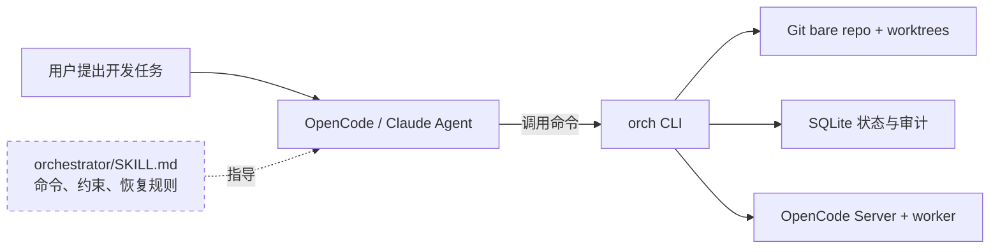

插件中的 `SKILL.md` 本身不创建 worktree，也不执行合并。它让 Agent 知道：

- 开发必须发生在独立 worktree，而不是 `main/`；
- `develop` 只能通过合并队列修改；
- 冲突应回源 worktree 修复，不能直接在 `main/` 处理；
- 接管 Agent 前必须先停止旧 writer 并取得 human lease；
- 清理前必须确认任务、run、lease 和 Git 状态都安全。

真正实施这些规则的是 `orch` CLI、Git、SQLite 状态机和 runtime worker。

---

## 2. 场景一：两个 Agent 并行开发，安全合并到 develop

### 2.1 业务背景

假设项目名为 `shop`，现在需要同时完成两个互不依赖的功能：

| Agent | 任务 | 分支 | 优先级 |
|---|---|---|---:|
| `agent-api` | 新增订单查询 API | `feat/order-api` | 1 |
| `agent-ui` | 新增订单列表页面 | `feat/order-page` | 2 |

如果两个 Agent 在同一个目录工作，它们可能互相覆盖文件、切换分支或污染未提交内容。orch 为每个 Agent 创建独立 worktree，同时保留一个只用于合并的 `main/`。

### 2.2 创建后的目录形态

```text
D:\projects\shop-orch\
|-- .bare.git\                         所有分支和提交
|-- main\                              develop 专用，只由 orch 合并
`-- worktrees\
    |-- agent-api-feat__order-api\     Agent API 独立开发
    `-- agent-ui-feat__order-page\     Agent UI 独立开发
```

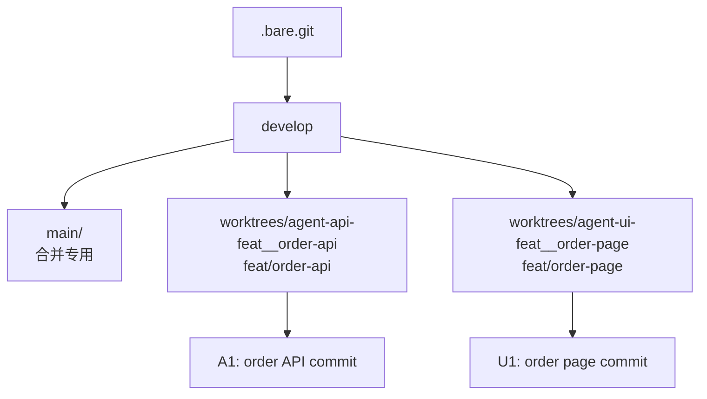

### 2.3 操作流程

#### 步骤 1：创建两个 worktree

```powershell
orch shop worktree-add agent-api feat/order-api --json
orch shop worktree-add agent-ui feat/order-page --json
```

两个 Agent 分别进入自己的目录开发和提交。它们共享同一个 bare repository，但工作区、HEAD 和未提交文件彼此隔离。

#### 步骤 2：分别入队

假设开发完成后提交为：

```text
feat/order-api  HEAD = a1b2c3d
feat/order-page HEAD = e4f5a6b
develop         HEAD = d000001
```

执行：

```powershell
orch shop enqueue agent-api feat/order-api `
  D:\projects\shop-orch\worktrees\agent-api-feat__order-api `
  --priority 1 --json

orch shop enqueue agent-ui feat/order-page `
  D:\projects\shop-orch\worktrees\agent-ui-feat__order-page `
  --priority 2 --json
```

入队时 orch 会把当前 HEAD 冻结到任务中：

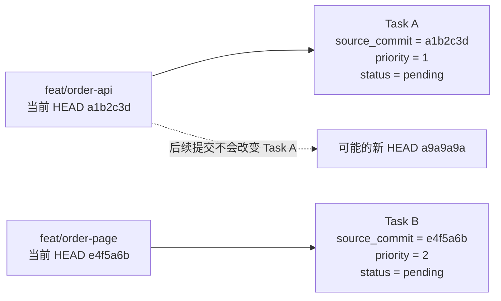

这一步是插件最关键的价值之一：**排队的是确定提交，不是会继续移动的分支名。**

#### 步骤 3：Coordinator 查看队列

```powershell
orch shop pending --json
orch shop diff <task-a-id>
orch shop changes <task-a-id>
```

队列排序结果：

```text
队首
  |
  +-- Task A  priority=1  source=a1b2c3d  pending
  |
  `-- Task B  priority=2  source=e4f5a6b  pending
队尾
```

#### 步骤 4：串行合并

```powershell
orch shop merge --once --json
orch shop merge --once --json
```

每次合并都只在 `main/` 中执行：

```text
git merge --no-ff --no-edit <frozen-source-commit>
```

状态变化如下：

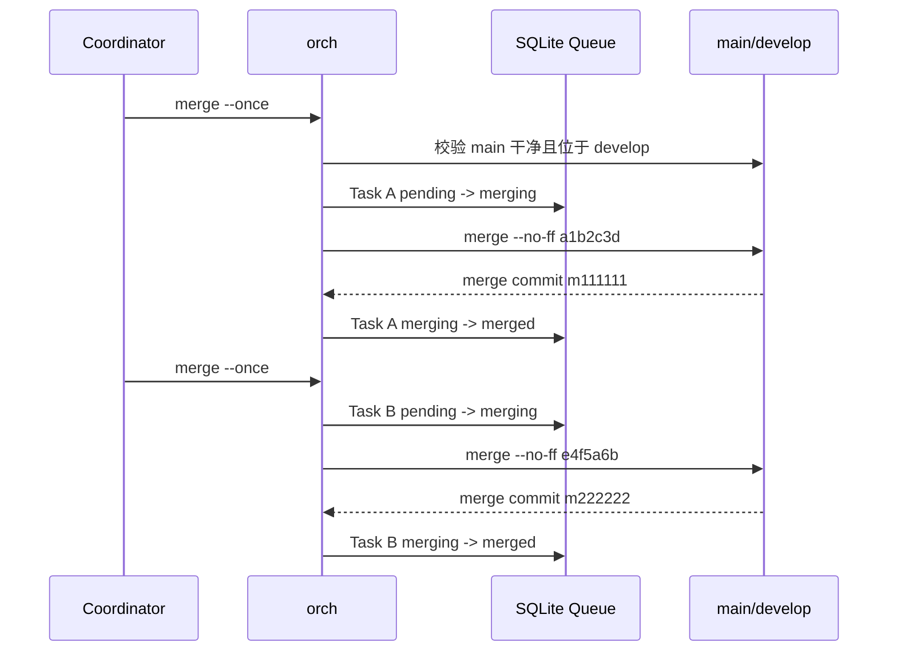

最终 Git 历史保持可审计：

```text
develop
  d000001
     |\
     | a1b2c3d  feat/order-api
     m111111    Merge Task A
        |\
        | e4f5a6b  feat/order-page
        m222222    Merge Task B  <- develop HEAD
```

### 2.4 如果第二个任务发生冲突

假设 Task B 与 Task A 都修改了订单字段定义：

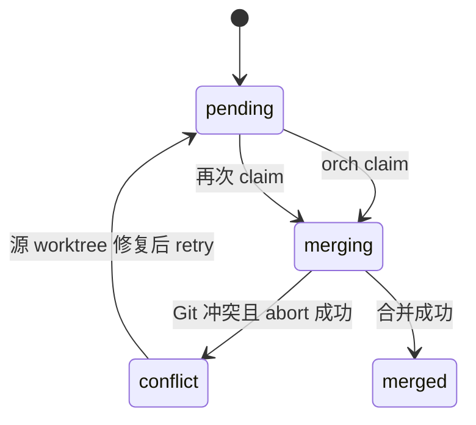

orch 会在 `main/` 收集冲突文件并执行 `git merge --abort`，然后停止队列。开发者或 Agent 回到源 worktree：

```powershell
Set-Location D:\projects\shop-orch\worktrees\agent-ui-feat__order-page
git merge develop
# 修复冲突
git add .
git commit -m "Resolve order page conflict with order API"

orch shop retry <task-b-id> --json
orch shop merge --once --json
```

`retry` 会验证新提交已经包含当前 `develop`，然后用新 HEAD 替换旧的冻结 SHA。

### 2.5 这个场景中插件解决了什么

| 没有 orch | 使用 orchestrator 插件与 orch |
|---|---|
| Agent 可能在同一目录互相覆盖 | 每个 Agent 使用独立 worktree |
| 多个 Agent 可能同时修改 `develop` | 项目锁 + 确定性队列串行合并 |
| 入队后分支继续变化，合并内容不确定 | 入队时冻结 `source_commit` |
| 冲突可能残留在共享主目录 | 自动 abort，回源 worktree 修复 |
| 崩溃后很难判断合并到了哪一步 | SQLite 状态、Git 证据和 audit log 可恢复 |

---

## 3. 场景二：Agent 执行中需要人工接管并恢复

### 3.1 业务背景

Agent 正在 `feat/payment-retry` worktree 中通过 OpenCode Session 修改支付重试逻辑。它遇到了一个需要人工判断的问题：

```text
第三方支付返回 timeout 时，应该立即重试，还是等待 webhook？
```

开发者希望进入同一个 Session 查看上下文并修改代码，但不能让 worker 与人工同时写入。

### 3.2 初始运行状态

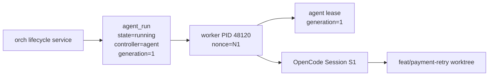

启动命令示例：

```powershell
orch runtime start --port 4096 --json

orch shop agent-start payment-agent feat/payment-retry `
  D:\projects\shop-orch\worktrees\payment-agent-feat__payment-retry `
  --prompt "Implement payment retry policy and commit the result" `
  --json
```

`agent-start` 返回 `run_id`。可以只读观察：

```powershell
orch shop agent-show <run-id> --json
orch shop agent-watch <run-id> --ticks 10 --json
```

### 3.3 先只读检查：fork inspect

如果开发者只想查看，不想打断 Agent：

```powershell
orch shop agent-takeover <run-id> --fork --json
```

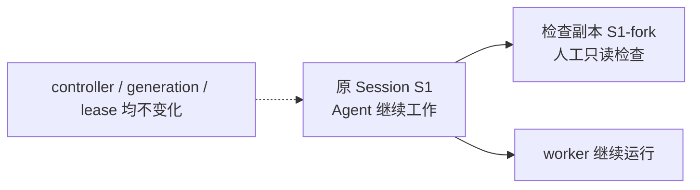

fork inspect 不改变原 run 的 worker、controller 或 generation，因此不能把 fork 当成原 Session 的可写控制权。

### 3.4 正式人工接管

确认需要人工修改后执行：

```powershell
orch shop agent-takeover <run-id> --json
```

接管不是简单打开 Session，而是一条严格的单写者转移链：

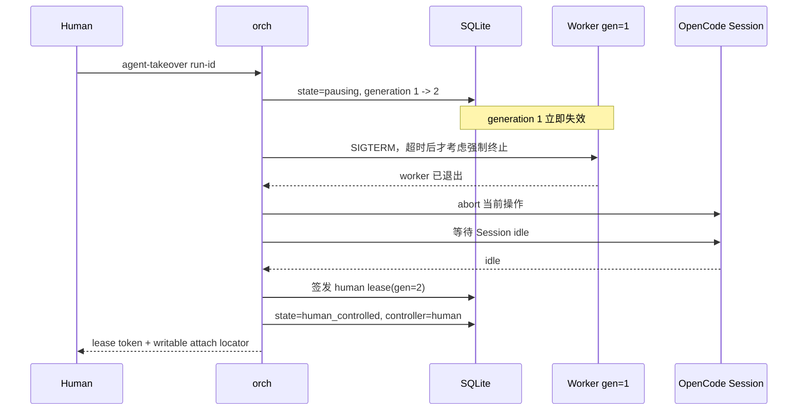

接管成功后的状态：

```text
接管前                              接管后
-----------------------------       --------------------------------
state       = running               state       = human_controlled
controller  = agent                 controller  = human
generation  = 1                     generation  = 2
worker PID  = 48120                 worker PID  = null / 已退出
lease       = agent, gen 1          lease       = human, gen 2
session     = S1                    session     = S1（上下文保留）
```

只有此时返回的 attach 才可以视为人工可写入口。若 worker 无法确认退出或 Session 无法确认 idle，orch 不会签发 human lease，而会进入 `manual_required`。

### 3.5 人工处理后恢复 Agent

人工完成策略选择、修改代码并确认 Session idle 后：

```powershell
orch shop agent-release <run-id> `
  --token <human-lease-token> `
  --resume --json
```

恢复过程再次更换 generation：

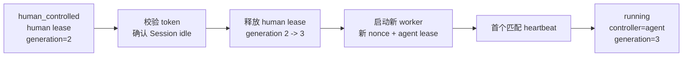

原 generation 1 worker 和 generation 2 human token 都不能再写。新 worker 复用同一个 Session，因此能够继续使用已有上下文，但不会自动重放无法证明是否已接收的旧 prompt。

如果人工处理后不希望恢复 Agent：

```powershell
orch shop agent-release <run-id> `
  --token <human-lease-token> --json
```

run 将安全进入 `exited`，之后可归档：

```powershell
orch shop agent-archive <run-id> --json
```

### 3.6 这个场景中插件解决了什么

| 风险 | orch 的处理 |
|---|---|
| 人工和 Agent 同时修改代码或 Session | generation + lease 保证单写者 |
| 只打开客户端却误以为已取得控制权 | 只有完成 takeover 并取得 human lease 才可写 |
| 旧 worker 在网络恢复后继续写 | generation fencing 使旧 worker 永久失效 |
| 接管时 Session 仍在生成内容 | abort 后必须确认 idle |
| 人工完成后丢失原会话上下文 | release/resume 复用原 Session，启动新 worker |
| 无法判断进程是否还是原 worker | PID + hostname + nonce + generation + heartbeat 联合确认 |

---

## 4. 两个场景如何串成完整开发闭环

实际使用时，两类能力通常串联出现：

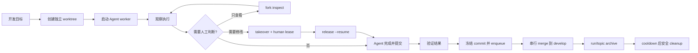

当前版本中，“创建 Topic、创建 worktree、启动 worker、验证、enqueue”仍是多个显式命令，不是一个完全自动化事务。这种边界有利于观察和恢复，但也是下一阶段需要补齐的产品编排能力。

## 5. 快速判断该用哪个命令

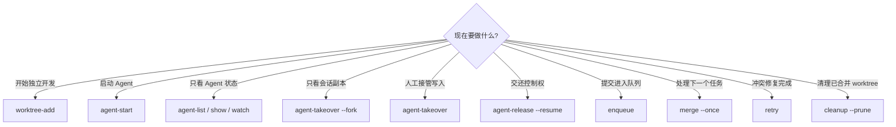

## 6. 使用时不要跨越的边界

1. 不要让 Agent 在 `main/` 中开发。
2. 不要绕过 orch 直接更新 `develop`。
3. 不要把普通冲突当作 `recovery_required` 处理，反之亦然。
4. 不要在没有 human lease 时把 attach 当成可写控制权。
5. 不要手工删除项目锁或直接编辑 SQLite。
6. 不要在 active、human-controlled、lost 或 manual-required run 存在时删除 worktree。
7. 不要假设插件本身是安全沙箱；它只约束经过 orch 的操作。

